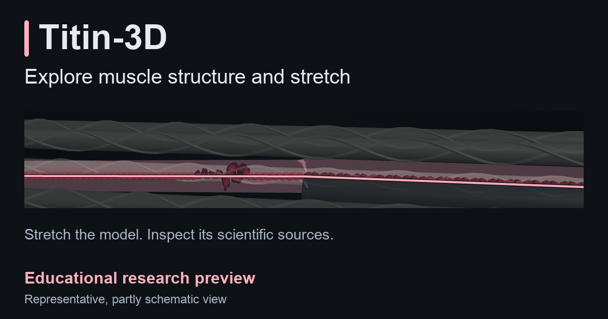
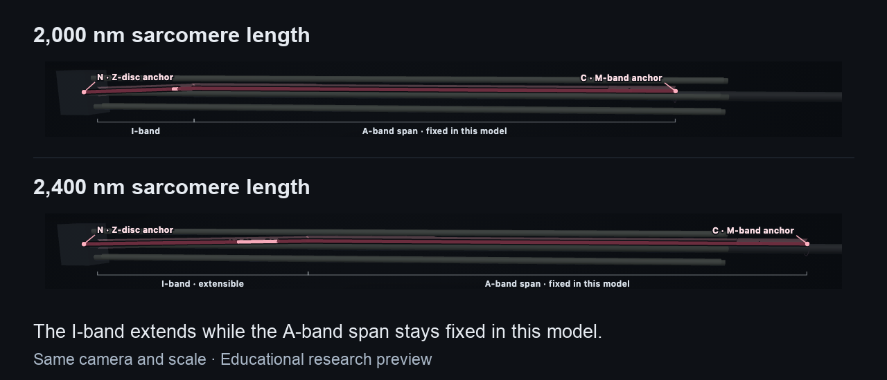

# Titin-3D

Explore where titin sits in a muscle's sarcomere, how the model changes during
stretch, and the scientific sources behind the visualization.

**[Open interactive demo](https://shotaronowhere.github.io/titin-3d/)** ·
[Try the stretch view](https://shotaronowhere.github.io/titin-3d/#v=2&depth=learn&step=stretch_spring&sl=2000&drawer=closed&scene=spring&confidence=0)

[](https://shotaronowhere.github.io/titin-3d/)

AI-assisted educational research preview. Independent scientific validation
and human usability review remain pending.

## What to try

1. Follow the five-beat **Tour** from muscle structure to the path of one titin
   molecule. On phones, choose **Show guide** to read the explanation; **Next**
   and **Previous** remain available with the guide closed.
2. At **Build and stretch the spring**, choose **Stretch**. Watch the extensible
   I-band beside the fixed A-band span, then use **Replay stretch** or the slider
   to compare lengths.
3. Click or tap a structure and choose **Why we know this**. Its **Evidence**
   record opens in **Research**; follow the sources to inspect the claim's basis
   and limitations. **Sources & build** also links back to this repository.



**The I-band extends while the A-band span stays fixed in this model.**
The comparison combines two real application frames at the same camera and scale.
These are length states, not activation or contraction states.

**[View static diagrams](release/fallback/scope.svg)** ·
[Static stretch diagram](release/fallback/extension.svg) ·
[Read the text Tour](release/LEARN_TRANSCRIPT.md)

## Engineering choices

- **Scientific records feed the renderer.** Geometry, provenance, and model
  assumptions live in structured records. The
  [specification loader](src/model/SpecLoader.js) validates them before use.
- **Explanations lead to evidence.** The
  [claim presenter](src/presentation/ClaimViewRenderer.js) connects an object's
  explanation to source records, evidence classes, and limitations.
- **One HTML file contains the application.** The
  [standalone build](scripts/build_standalone.mjs) embeds Three.js, project
  modules, and scientific data for online and offline viewing. Ordinary startup
  needs no network requests or runtime installation.

[Read the implementation](docs/DEVELOPMENT.md) for setup, API entry points, test
selection, and build identity. [Architecture](ARCHITECTURE.md) documents the
model and renderer in more detail.

## My role and development process

I developed this project with substantial AI assistance. The repository contains
the scientific source records, model assumptions, implementation, and verification
evidence. Independent scientific review remains pending.

## Scientific scope

The sequence reference is human TTN **Q8WZ42-1**, without an assigned
tissue-specific construct. This is a representative, partly schematic depiction
with passive geometry and force estimates; it does not simulate active muscle
contraction or establish measured human forces. Independent validation is pending.
See the [model limitations](release/LIMITATIONS.md) and
[scientific authority record](release/SCIENTIFIC_AUTHORITY.md) for applicability
ranges, source transfers, and the distinction between parameter sensitivity and
confidence intervals.

## Run locally

**View without installing dependencies:** download the repository and open the
committed [index.html](index.html) in a WebGL-capable browser. On macOS:

```sh
open index.html
```

The application and embedded data work offline. External scientific citations,
the GitHub link, and the error panel's online recovery links need an internet
connection. Keep the companion `release/` directory to use the static diagrams
offline.

**Develop or rebuild:** follow the [development setup](docs/DEVELOPMENT.md#setup)
with Node.js 20.19.2, npm 11.5.2, and Python 3.12+. Edit the template and source
modules, then regenerate the standalone and companion materials.

## Project status and verification

**Not yet release-ready for scientific use; independent scientific validation
and formal human usability review remain outstanding.**
The [formal gate record](data/release_gates.json) keeps `release_ready: false`.
Portfolio presentation and scientific release are separate decisions.

The [September 20 readiness record](evidence/linkedin-readiness/2026-09-20/READINESS.md)
records this presentation pass's candidate identity, actual checks, image
provenance, review scope, and publication status. Owner review and publication
are tracked separately from local engineering verification.

Earlier evidence is retained with its original scope:
[September 9 delivery](evidence/mvp-final/2026-09-09/DELIVERY.md) and
[September 10 mobile-guide checks](evidence/ux/guide-fixes-2026-09-10/README.md).
The September 10 WebKit results cover targeted desktop-engine tests and emulated
viewports; they do not certify physical Safari/iPhone or LinkedIn's in-app browser.

## License

Project content is licensed under **CC BY 4.0**; see [LICENSE](LICENSE).
Bundled dependencies retain their own licenses and attribution notices,
including Three.js under the MIT license. Those notices remain in the generated
standalone; project licensing does not relicense upstream code.
