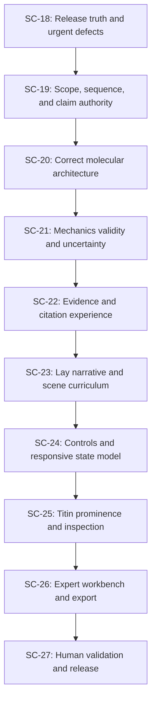
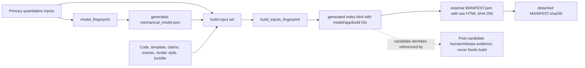

# Titin MVP Readiness — Scientific, Educational, and UX Synthesis Plan

> **Status:** Independently reviewed governing implementation plan, revision 3, 2026-08-09. Scientific decisions
> SD-01–SD-05 remain pending; the plan is executable, not the disputed biological values.
>
> **Supersedes:** `2026-08-07-showcase-prereview-remediation.md`. That plan remains useful as
> historical analysis, but it must not be executed: its proposed distal-Ig density inference,
> hard-coded example count, narrow-screen scrolling remedy, and rejection of several interaction
> findings are not safe MVP decisions.

> **Implementation-readiness note:** Revision 1 was a complete strategy and blocker map, but it was
> not sufficiently procedural for independent junior engineers. Revision 2 adds the repository
> architecture primer, shared interface contracts, exact sprint prerequisites and outputs, explicit
> human-decision blockers, browser-test tooling, test-first/negative-control rules, verification
> commands, and a required handoff record for every sprint.
>
> **Revision 3 correction:** An independent Claude Opus repository audit found impossible sprint
> exits, a post-freeze dependency mutation, identity/digest circularities, an SC-22 dependency on
> future scene state, incomplete scope-file ownership, and an undefined boundary between embedded
> science and post-candidate evidence. Revision 3 repairs those defects and incorporates the
> validated major/minor findings before any sprint is assigned.

## Outcome

Ship one defensible standalone titin experience that succeeds at two levels without presenting
two contradictory products:

1. A first-time visitor can identify titin, understand the sarcomere, distinguish titin from the
   ATP-powered myosin motor, run a meaningful stretch demonstration, and explain titin's spring,
   scaffold, and signaling roles.
2. A titin researcher can identify the exact sequence construct, trace every material claim to a
   supporting source and locator, inspect the model's equations and transferred parameters,
   understand its validity limits, reproduce or export its outputs, and see unresolved questions
   represented as unresolved.
3. The application, model, and release artifact have distinct, verifiable identities. A passing
   automated suite never substitutes for biological adjudication, usability evidence, visual QA,
   or deployed-artifact parity.

The product is an evidence-linked literature synthesis and explanatory model. It is **not** a
new structural determination, a patient-specific simulator, a definitive tissue-expression map,
or a claim that disputed titin registers have been settled.

## MVP release definition

The MVP may be called ready only when all of the following are true:

- **Scientific scope:** the page names the exact TTN accession/isoform or explicitly calls itself a
  reference-sequence construct; sequence, mechanics, structural context, species, muscle type,
  preparation, and transfers are separately stated.
- **Sequence architecture:** region boundaries and domain counts are derived from a pinned feature
  record and approved by a named sequence/structure reviewer. No domain count is inferred from a
  residues-per-domain heuristic.
- **Structural geometry:** the I-band, A-band, kinase, and M-line budgets are internally consistent;
  contested register claims are separated rather than averaged into false certainty.
- **Mechanics:** a visible number is emitted only where the declared model is valid. Parameters,
  equations, sources, transfer assumptions, sensitivity, and uncertainty are available beside the
  output and in a machine-readable export.
- **Evidence:** every material claim has a claim-support record with a source, exact locator,
  subject/preparation, support relationship, evidence class, caveat, and reviewer status.
- **Learning:** in one preregistered study of five uncoached non-specialists on one frozen
  candidate, every scored question is answered correctly by at least 4 of 5 participants and all 5
  distinguish titin from the active motor. This is a small-sample smoke test for gross
  comprehension failure, not an estimate of population comprehension; the release record states
  the sample size, exact rule, prior candidate-study history, and limitation.
- **Expert trust:** two named release reviewers—one sequence/structure specialist and one mechanics
  specialist—leave no unresolved CRITICAL or MAJOR finding. Each role has an independent reviewer
  who did not author the affected implementation or scientific ruling, or an independent
  countersignature where the earlier SD reviewer also participates. Conflicts and retained
  disagreement are visible in the release record and product.
- **Interaction:** primary actions are understandable without tooltips at desktop and mobile widths;
  active state is truthful; titin and its labelled regions are reliably inspectable by mouse,
  keyboard, and touch.
- **Accessibility:** [WCAG 2.2](https://www.w3.org/TR/WCAG22/) AA target, complete keyboard path,
  visible focus, reduced-motion support, 200% text zoom, coarse-pointer targets, and review by a
  named accessibility reviewer in grayscale and common color-vision simulations.
- **Release identity:** the deployed artifact matches the finalized release manifest, including
  model fingerprint, application revision, build-input fingerprint, raw bundle checksum, and
  export-contract fingerprint plus externally recorded sample-export checksums.

`release_ready` remains false until every required gate contains its evidence. No sprint may turn
a human or specialist gate green by inserting an agent persona, an inferred name, or an automated
test result.

## Product architecture decisions

These decisions are part of the plan, not hypotheses left to individual implementers.

### One product, two depths

- Replace the audience choice **Guided / Evidence** with **Learn / Explore**.
- Learn is a narrated scientific story with a small, stable set of semantic scenes.
- Explore exposes inspection, measurement, evidence, sources, advanced cameras, and layer controls.
- Evidence is not an audience. It remains a drawer/workbench available from either depth.
- A visitor may move from Learn to Explore without losing sarcomere length, scene, or selection.

### Titin remains the protagonist

- Titin keeps the single strongest identity color and a continuous Z-disc-to-M-line route.
- Opacity continues to encode scientific confidence. Selection, hover, onboarding, and identity use
  separate channels and must not modify evidence opacity.
- The default scene shows one representative titin clearly and states that it is representative,
  not the complete stoichiometric complement.
- An optional context view may show the approximate multiplicity around a half thick filament only
  after the relevant evidence and uncertainty are approved.

### Sources support the story without leading it

- Do not place a bibliography at the top of the control bar.
- A clicked-object explanation ends with compact citations.
- A scene or chapter may expose a small “Sources for this view” link after its explanation.
- The drawer ends with Sources, initially filtered to the selected object, scene, or model output,
  with an explicit “All sources” expansion.
- Citation markers must never obscure the primary lay explanation.

### A visible model output is a scientific claim

- Force, extension, periodicity, domain count, residue range, and component position receive the
  same claim-support treatment as prose.
- “Modeled” is not a disclaimer that licenses false precision. A modeled value needs a domain of
  validity, parameter provenance, transfer statement, and uncertainty or sensitivity treatment.
- Outside the supported regime, geometry may remain explorable, but the readout says “not
  evaluated” or “extrapolation” and never looks equivalent to an in-range result.

## Scientific decision dossiers

Five decisions must be made by the appropriate humans before their dependent implementation can
be accepted. Agents and tests prepare the evidence; they do not cast the deciding vote.

| ID | Decision | Required reviewer | Required output |
|---|---|---|---|
| SD-01 | Exact Q8WZ42 sequence construct, N2A definition, and proximal/PEVK/distal region boundaries | TTN sequence/domain specialist | Approved residue partition and feature mapping |
| SD-02 | A-band super-repeat, kinase, bare-zone, and M-line axial budget | Titin/thick-filament structural specialist | Approved boundary model or explicitly schematic alternative |
| SD-03 | Relationship among the sequence-defined 11-domain repeat; the axial spacing reported by `10.1016/j.yjmcc.2019.05.026`, whose measurement type, species, preparation, and locator the reviewer must establish; the myosin axial repeat; and any molecular-span or register hypothesis | Structural specialist familiar with A-band periodicity | Separate quantities, reviewer-approved labels, evidence classes, and wording without pre-assigning disputed measurement types |
| SD-04 | Force-law parameter transfers, PEVK contour per residue, Ig persistence length, slack regime, working range, unfolding limit, and uncertainty treatment | Titin mechanics specialist | Parameter/validity table and approved displayed outputs |
| SD-05 | Z-disc and M-line anchoring language, telethonin/alpha-actinin emphasis, and representative-titin stoichiometry | Sarcomere/titin structural specialist | Approved explanatory claims and not-claimed statements |

Every dossier records reviewer name, affiliation, date, examined artifact/model fingerprint,
decision, dissent, and follow-up. “No decision” is a valid recorded state and requires the UI to
show uncertainty; it is not permission to choose the visually convenient answer.

Decision consumption is explicit:

- SD-01 has no `DEFERRED` implementation path. Without an approved coordinate frame and residue
  partition, SC-19 may finish only as `CODE_COMPLETE_BLOCKED_SCIENCE`; SC-20 does not start.
- SD-02 and SD-03 may be `DEFERRED` only when the decision supplies the exact public caveat and a
  reviewer-approved schematic representation that does not choose a disputed boundary/register.
- SD-04 may be scaffolded while `PENDING`/`DEFERRED`, but SC-21 cannot be `COMPLETE`, no pN value or
  supported-range export may ship, and the MVP cannot release until SD-04 is `APPROVED`.
- SD-05 may defer a disputed attachment/stoichiometry only by providing explicit unknown/not-claimed
  wording and a depiction rule that does not imply the unresolved mechanism.

### Starting source set—not a substitute for adjudication

The first pass should pin and examine at least the official
[UniProt Q8WZ42 record](https://www.uniprot.org/uniprotkb/Q8WZ42), the N2A architecture described by
[Stronczek et al.](https://pmc.ncbi.nlm.nih.gov/articles/PMC8042602/), the mechanics work of
[Linke et al.](https://pmc.ncbi.nlm.nih.gov/articles/PMC20927/), and the A-band periodicity/register
discussions in [Tonino et al.](https://pmc.ncbi.nlm.nih.gov/articles/PMC6639027/) and
[Caremani et al.](https://pmc.ncbi.nlm.nih.gov/articles/PMC7802359/). These are starting points for
the claim audit, not blanket support for every current statement. Exact feature, figure, table,
species, and preparation locators are still required.

## Data and evidence architecture

The current records conflate sequence identity, tissue context, mechanics transfers, and render
claims. Add six bounded records rather than embedding more unstructured prose in the template:

| Record | Responsibility |
|---|---|
| `data/scientific_scope.json` | Sequence construct, mechanics preparation, structural context, transfers, exclusions, and approved public badge text |
| `data/titin_sequence_features.json` | Offline pinned feature snapshot: accession, isoform, retrieved/release date, source checksum, feature IDs, residue ranges, and region membership |
| `data/claim_support.json` | Claim-to-source entailment matrix, including locators and review status |
| `data/mechanical_parameters.json` | Sole source of force-law constants, units, uncertainty/ranges, applicability, species/preparation, transfers, and source IDs |
| `data/scientific_decisions.json` | SD-01–SD-05 question, evidence packet, status, named ruling, dissent, reviewed fingerprints, and downstream claim IDs |
| `data/render_style.json` | Deterministic presentation-only seed and visual-envelope parameters; required build input but explicitly excluded from quantitative model identity |

`data/mechanical_model.json` remains generated output. `data/references.json` remains the canonical
bibliography. `data/showcase_claims.json` remains the visual admission/attention record but is
versioned deliberately so each admitted claim points to `claim_support.json`; its old byte digest
must not prevent legitimate reviewed science corrections.

A claim-support entry must contain at least:

```json
{
  "id": "stable_claim_id",
  "subject": {
    "species": "human",
    "accession": "Q8WZ42-1",
    "muscle_or_tissue": null,
    "preparation": "reference sequence"
  },
  "statement": "one atomic, testable claim",
  "quantity": null,
  "claim_class": "MEASURED | STRONGLY INFERRED | MODELED | INFERRED | SCHEMATIC | UNKNOWN",
  "render_class": "MEASURED | STRONGLY INFERRED | MODELED | INFERRED | SCHEMATIC | UNKNOWN",
  "support": [
    {
      "source_id": "registry key",
      "locator": "feature, figure, table, page, or section",
      "relationship": "direct | corroborating | transfer | context",
      "extraction_note": "what the cited location actually supports"
    }
  ],
  "model_dependencies": [],
  "limitations": [],
  "not_claimed": [],
  "review": { "status": "PENDING", "reviewer": null, "affiliation": null, "publication_consent": false, "locator_verified_independently": null, "reviewed_on": null, "reviewed_payload_sha256": null }
}
```

Automated validation may prove that fields are complete, identifiers resolve, quantitative units
agree, and review evidence exists. It must never call semantic entailment “PASS” without a named
human review. An approved public claim also requires reviewer name, affiliation, and publication
consent. `locator_verified_independently` must be true: the reviewer records that they opened the
named source/locator and verified what it supports rather than merely accepting the engineer's
proposed binding. An approved claim's `reviewed_payload_sha256` is the canonical digest of the claim
excluding its `review` object. Any statement, source binding, locator, support relationship,
subject, limitation, model dependency, or not-claimed change clears approval to `PENDING`; an
engineer may not recompute an approved digest while retaining the old reviewer/date.
The digest proves that the reviewed relation was not changed afterward; it does not prove that the
reviewer judged entailment correctly. That remains the named human's responsibility.

`direct` is a source-support relationship, not a seventh evidence class. Public “direct evidence”
means a `MEASURED` claim with at least one `direct` support relation. `SCHEMATIC` on a render says
how the picture was constructed, not how strong the biological claim is. SC-19 preserves the six
existing evidence tokens and makes the claim/render axes atomic instead of inventing a competing
vocabulary.

For this plan, a **material claim** is any public assertion about identity/scope, residue or domain
membership, count, length, position, periodicity, structure, interaction, biological function,
mechanical behavior, force/extension, evidence strength, model validity, or depiction meaning. It
includes chart axes/readouts and dynamically generated labels. Pure navigation (“Next”, “Close”),
interaction instructions, and clearly subjective presentation labels are not scientific claims.
Every material claim is rendered from or names stable claim IDs; the HTML template may not introduce
an unregistered scientific sentence as glue copy.

Source locators and extraction notes are concise paraphrases. Do not copy source figures, tables,
or long passages into the repository or UI; use stable identifiers/locators and the project's own
procedural visualization.

The other new records use these minimum contracts. Engineers may add fields, but not rename or
reinterpret these without a schema-version migration:

`data/scientific_scope.json`:

```json
{
  "schema": "titin-scientific-scope/1",
  "sequence": { "species": "Homo sapiens", "gene": "TTN", "accession": "Q8WZ42", "isoform_id": "Q8WZ42-1", "construct_label": "reviewed text", "source_ids": [] },
  "mechanics": { "parameter_set_id": "stable id", "species": "reviewed value", "muscle": "reviewed value", "preparation": "reviewed value", "transfers": [] },
  "structural_context": { "scope": "reviewed text", "transfers": [] },
  "representation": { "reference_molecule_policy": "reviewed text", "multiplicity_claim_id": null },
  "public_badge": "reviewed text",
  "not_claimed": []
}
```

`data/titin_sequence_features.json`:

```json
{
  "schema": "titin-sequence-features/1",
  "source": { "provider": "UniProt", "record": "Q8WZ42", "isoform_id": "Q8WZ42-1", "sequence_version": 0, "entry_version": 0, "coordinate_frame": "canonical", "url": "canonical upstream URL", "license": "upstream license identifier", "release_or_retrieved_on": "YYYY-MM-DD", "upstream_sha256": "full digest" },
  "sequence_length_aa": 0,
  "features": [{ "id": "upstream stable/generated id", "type": "DOMAIN", "start": 1, "end": 1, "label": "upstream label", "locator": "upstream feature locator" }],
  "isoform_mapping": { "applied": false, "var_seq_feature_ids": [], "offset_table": [] },
  "excluded_feature_types": [],
  "region_policy_decision_id": "SD-01"
}
```

`coordinate_frame` is mandatory in both the pinned feature record and `data/titin.json`. Coordinates
remain in the canonical frame unless an approved import applies the upstream record's own VAR_SEQ
features and stores every offset. VAR_SEQ, VARIANT, and CONFLICT records remain separate typed
lists; they are never silently mixed into `features`. A sequence-version change is a reviewed
renumbering event, not an ordinary refresh.

`data/mechanical_parameters.json`:

```json
{
  "schema": "titin-mechanical-parameters/1",
  "parameter_set_id": "stable id",
  "temperature_K": { "value": 0, "source_ids": [], "locator": "", "applicability": "" },
  "regions": { "region_id": { "law": "wlc | ewlc | reviewed law", "parameters": {}, "contour_source": "sequence | explicit", "validity": {}, "subject": {}, "transfers": [], "source_support_ids": [] } },
  "sensitivity_scenarios": [],
  "decision_id": "SD-04"
}
```

`data/render_style.json`:

```json
{
  "schema": "titin-render-style/1",
  "render_seed": "stable reviewed seed",
  "disordered_chain": { "algorithm": "seeded_irregular_ribbon_v1", "prng": "mulberry32", "path_samples": 0, "max_transverse_fraction": 0, "screen_line_width_css_px": 0 },
  "render_class": "SCHEMATIC",
  "decision_id": "SD-05",
  "not_claimed": []
}
```

Every `render_style.json` number is presentation-only and validators forbid model/geometry code
from consuming it as a molecular coordinate, contour, force parameter, or evidence strength. Its
seed/algorithm drive deterministic visual offsets whose endpoints and canonical axial coordinates
remain unchanged.

The examples deliberately use zero/empty placeholders rather than proposed biological values.
Validators reject them in an approved record. This prevents a code-plan example from becoming a
scientific default by copy and paste.

## Dependency graph



Implementation PRs merge in this order. That is deliberate: `SpecLoader.js`, the standalone
builder, fingerprint inputs, generated pack, presentation record, and HTML template are shared
integration surfaces. Evidence packets and human reviews may proceed concurrently, but a later
sprint does not merge against an earlier scientific schema or geometry. All arrows are load-bearing.

## Global implementation rules

1. Work from a clean branch prefixed `codex/`; record the starting commit and deployed commit.
2. Never edit generated `index.html`, generated mechanical output, or release manifests by hand.
3. Keep the Python and browser solvers numerically equivalent, but move their shared parameters to
   `data/mechanical_parameters.json`; do not maintain constants in two source files.
4. Run Node tests serially on this project. Preserve the established `npm run build` →
   `npm run pack` → `npm run verify` order after every sprint that affects the artifact.
5. Every scientific data correction lands with a failing test or validator first and a negative
   control proving the new gate fails closed.
6. Tests derive expected domain counts and boundaries from the pinned feature record. A test may
   pin a reviewed decision ID and source checksum; it must not repeat an unexplained magic number.
7. Density heuristics may emit warnings for human inspection. They are not authorities and cannot
   promote a count to MEASURED.
8. Preserve old shared URLs through a versioned state migration. New scene names may change; old
   chapter/camera URLs must resolve to an explicit equivalent or a documented safe fallback.
9. Test scientific semantics through stable claim/scene IDs, not exact prose bytes. Copy tests may
   enforce required concepts, word budgets, and forbidden overclaims.
10. A browser-default visual style is a defect. Every link, focus ring, selection state, and text
    color must resolve through a declared token and contrast pair.
11. No hidden state change. If a chapter changes sarcomere length, scale, layers, or selection, the
    change is announced and reversible.
12. No gate is relaxed merely to land a change. If a legacy gate encodes a superseded decision,
    migrate it and record why.
13. Human and expert results are immutable observations. Failed findings create follow-up work;
    they are not edited into a pass.
14. `src/index.template.html` is not covered by TypeScript `checkJs`. Put reusable logic in typed
    ES modules and leave the template responsible for DOM wiring only.
15. `scripts/build_standalone.mjs` auto-bundles modules imported by other modules, but a **new direct
    import from the page template** must be added consistently to its entry exports, page
    destructuring, and returned bundle object. A browser smoke test is mandatory after such a change.
16. New required JSON records must be added to `SPEC_FILES`, assigned in `Spec`, checked for
    presence/cross-references in `Spec.check()`, included in the model fingerprint when scientific,
    and therefore embedded automatically by the standalone builder. Optional records are forbidden
    for release-critical science. Post-candidate attestations are the exception: release gates,
    lay results, accessibility evidence, visual review, and expert sign-off attest to the embedded
    artifact and are forbidden from `SPEC_FILES` or either fingerprint.
17. A sprint may finish code while waiting for a human ruling only with status
    `CODE_COMPLETE_BLOCKED_SCIENCE`. It may not satisfy its exit gate, unblock its dependent sprint,
    or substitute a placeholder scientific value.
18. `npm run verify`, every `verify:scNN`, and `verify:mvp` are hermetic after the documented
    dependency/browser bootstrap: they open no non-loopback socket. Structure downloads, DOI web
    lookups, deployment preflight, hosted smoke, and `verify_deployment.mjs` are explicit external
    operations outside those commands. Citation validation means offline registry closure; human
    review establishes entailment.
19. Release reproduction uses the exact Node/npm versions pinned in `.node-version`,
    `package.json#packageManager`, and the lockfile. A semver range alone is not a reproducibility
    claim.

## Engineer execution handbook

This section and the assigned sprint section are the minimum reading for an implementer. Historical
plans are not required. The immediately preceding sprint handoff is required because it records the
exact schema and artifact revision being consumed.

### Environment and baseline

From the repository root:

```sh
npm ci
python3 -m venv .venv
.venv/bin/python -m pip install -r requirements.txt
npm run browser:install
npm run verify
git status --short
```

Expected baseline: the exhaustive gate passes and the worktree is clean. If it does not, record the
failure in the sprint handoff and stop; do not absorb an unrelated repair into the assigned sprint.
Node tests remain serial because the existing parallel runner has frozen development machines.

### Current architecture map

| Concern | Current authority and rule |
|---|---|
| Required data | `src/model/SpecLoader.js` → `SPEC_FILES`; `Spec.load()` loads it and `Spec.check()` rejects cross-file drift |
| Public model boundary | `src/model/TitinModel.js`; render/presentation code should not read raw biological constants independently |
| Geometry | `src/geometry/GeometryEngine.js` plus strategy/representation modules; `data/structural_states.json` contains generated/reference states |
| Mechanics | `scripts/mechanical_model.py` is the current Python reference; `src/geometry/MechanicalModel.js` is the browser port; SC-21 removes duplicated constants |
| Viewer/camera/picking | `src/render/Viewer.js`; biological scene and pick-target registry in `src/render/SarcomereScene.js` |
| Story and URL state | `src/presentation/StoryController.js`; current hash keys and migration behavior are unit tested |
| Screen-space placement | `src/presentation/StageLayout.js`; keep placement arithmetic pure and Node-testable |
| DOM wiring | `src/index.template.html`; not typechecked, so move reusable decisions to modules |
| Standalone | `scripts/build_standalone.mjs` generates committed `index.html`; never edit the generated file |
| Science identity | `scripts/build_fingerprint.mjs`; currently data-only and intentionally replaced/expanded by SC-18 |
| Release pack | `scripts/build_release_pack.mjs` generates `release/`; `check:pack` rejects staleness |
| Release evidence | `data/release_gates.json` plus `scripts/validate_release_gates.py`; a human gate requires human evidence |
| Visual matrix | `src/presentation/VisualMatrix.js` and `scripts/capture_visual_matrix.mjs`; the script currently emits a manifest, not screenshots |

### Required browser harness

The current repository has reproducible browser manifests but no automated browser driver. SC-18
adds [`@playwright/test`](https://playwright.dev/docs/intro) as a development dependency and creates:

- exact dev-dependency pins for `@playwright/test` and
  [`@axe-core/playwright`](https://github.com/dequelabs/axe-core-npm), plus `.node-version` pinned to
  Node 20.19.2 and `packageManager` pinned to `npm@11.5.2`;
- `playwright.config.js`: serves the repository on a declared loopback-only test port with no
  accidental reuse of an unrelated server, uses the committed standalone
  artifact, sets `workers: 1`/`fullyParallel: false` to protect the existing resource-constrained
  test environment, captures trace/screenshot on failure, and runs Chromium for the routine gate;
- `test/browser/smoke.spec.js`: boot, console, identity, drawer routing, focus return, and `file://`
  standalone smoke where the platform permits it;
- `test/browser/helpers.js`: viewport, reduced-motion, coarse-pointer, computed-style, and collision
  helpers shared by later sprints;
- `npm run test:browser`: routine Chromium suite;
- `npm run test:browser:matrix`: Chromium, Firefox, and WebKit automation for SC-27.
- `npm run browser:install`: runs the lockfile-local `playwright install chromium firefox webkit`
  once to install the exact browser revisions selected by the locked package. This bootstrap may
  use the network; verification may not. OS-level browser dependencies are documented separately
  and never installed implicitly by a test command.

Automated WebKit is not proof of actual Safari, and emulated touch is not proof of a real touch
device. SC-27 retains both human checks. Browser binaries are CI/development prerequisites, not
runtime dependencies and do not enter the standalone bundle.

### Frozen candidate and evidence boundary

The artifact being reviewed cannot contain the review that attests to it. SC-18 adds a
classification validator and destructive control enforcing this exact boundary:



- **Embedded/build inputs:** every required `Spec` record, including `scientific_scope.json`,
  `titin_sequence_features.json`, `claim_support.json`, `scientific_decisions.json`,
  `mechanical_parameters.json`, `render_style.json`, presentation/scenes, code, template, builder,
  package metadata, and lockfile. Their science/claim approvals are finalized before SC-27 freezes
  a candidate. Changing one creates a new candidate.
- **Never a build/model input and never embedded:** `data/release_gates.json`,
  `docs/human-evidence-pipeline.md`, `docs/sprint-reports/**`, `evidence/**`, `README.md`,
  `PROGRESS.md`, `SHOWCASE_PREREVIEW_FINDINGS.md`, findings dispositions, and captured human-review
  media. `release/MANIFEST.json` and `release/MANIFEST.sha256` are deterministic outputs, never
  inputs. The candidate manifest lists deterministic artifact bytes only; it does not list
  post-candidate human evidence.
- **Evidence locations:** append-only lay records live under `evidence/lay-studies/`, expert
  findings/sign-offs under `evidence/expert-reviews/`, accessibility reports under
  `evidence/accessibility/`, visual review under `evidence/visual-matrix/`, and rehearsals under
  `evidence/rehearsals/`. `data/release_gates.json` stores status plus paths/digests into those
  records. The final release record may digest the evidence index externally, but neither the
  evidence nor its index changes the candidate identity.

Every human/review evidence JSON begins with this common envelope; kind-specific schemas add the
questions, findings, cells, or rehearsal steps named by SC-27:

```json
{
  "schema": "titin-release-evidence/1",
  "kind": "lay-study | expert-review | accessibility | visual-matrix | rehearsal",
  "record_id": "stable append-only id",
  "protocol_version": "stable protocol id",
  "candidate": { "model_fingerprint": "", "app_revision": "", "build_inputs_fingerprint": "", "export_contract_fingerprint": "", "index_html_sha256": "", "manifest_sha256": "" },
  "actor": { "role": "", "public_name": null, "anonymous_id": null, "publication_consent": false, "conflicts": [] },
  "performed_on": "YYYY-MM-DD",
  "status": "PASS | FAIL | ABANDONED",
  "evidence": {},
  "limitations": []
}
```

`record_id` is never reused and a committed observation is never overwritten. A correction is a
new record referencing the superseded record, which remains in history. Participant records use an
anonymous ID and never publish names/contact details. Reviewer names appear only with publication
consent. `evidence/INDEX.json` contains sorted `{path, bytes, sha256}` rows and no self-checksum; its
digest is stored externally in the final release decision.

After candidate freeze, every evidence commit reruns `check:build`, `check:pack`, and identity
comparison. Any embedded byte or identity change voids the candidate. A reviewer finding that
requires science, claim, mechanics, scene, code, or template changes returns to the owning sprint,
creates a new candidate, and reruns affected gates.

### Scientific decision record

`data/scientific_decisions.json` is required from SC-19 onward:

```json
{
  "schema": "titin-scientific-decisions/1",
  "decisions": {
    "SD-01": {
      "status": "PENDING | APPROVED | DEFERRED",
      "question": "one bounded decision",
      "evidence_packet": [{ "path": "review packet path", "sha256": "full digest" }],
      "reviewer": null,
      "reviewed_on": null,
      "reviewed_model_fingerprint": null,
      "reviewed_payload_sha256": null,
      "ruling": null,
      "public_caveat": null,
      "dissent_or_uncertainty": [],
      "downstream_claim_ids": [],
      "implementation_verification": { "status": "PENDING | VERIFIED", "reviewer": null, "reviewed_on": null, "implemented_model_fingerprint": null, "implementation_evidence": [] }
    }
  }
}
```

When present, `reviewer` is `{ "name": "…", "affiliation": "…", "publication_consent": true }`.
For `APPROVED`, reviewer name, affiliation, publication consent, date, reviewed fingerprint,
reviewed decision-payload
digest, and ruling are mandatory.
For `DEFERRED`, the unresolved issue and required public caveat are mandatory. `PENDING` contains no
invented reviewer data. `validate_scientific_decisions.py` enforces those rules and ensures a sprint
cannot consume a decision unless its status permits the proposed action.

`reviewed_payload_sha256` is the SHA-256 of canonical JSON for the decision object after removing
`status`, `reviewer`, `reviewed_on`, `reviewed_model_fingerprint`, and
`reviewed_payload_sha256`, and `implementation_verification`. It therefore covers `question`, the byte digests of every evidence packet,
`ruling`, `public_caveat`, `dissent_or_uncertainty`, and `downstream_claim_ids`. Any covered-field or
packet-byte change resets the decision to `PENDING` and clears implementation verification; an
engineer may not recompute a digest while retaining the prior reviewer/date. The validator uses one
shared canonicalizer and includes a self-reference/stale-approval destructive control.

`reviewed_model_fingerprint` identifies the input model the reviewer examined while making the
ruling; applying that ruling may legitimately produce a new model fingerprint. The consuming
sprint therefore obtains `implementation_verification` from the matching specialist after the
change. It records the resulting `implemented_model_fingerprint` for model-affecting decisions and
`implementation_evidence` rows as `{path, sha256}` for copy/render-only decisions. Because decisions are
excluded from `MODEL_INPUTS`, recording the resulting model fingerprint is non-self-referential.
No build-input fingerprint is stored inside this embedded record. SC-27's external sign-off supplies
candidate build/artifact identity. A later implementation change clears verification.

### Shared module interfaces

Later engineers implement against these shapes. A sprint may refine a field only by updating this
section and its consumer tests in the same reviewed change.

```js
// SC-19: normalized scope for badges, cards, parameters, and exports.
scopeLedger(spec).publicBadge
scopeLedger(spec).sequence
scopeLedger(spec).mechanics
scopeLedger(spec).structuralContext
scopeLedger(spec).notClaimed

// SC-19/20: exact region-feature reconciliation.
mapFeaturesToRegions(sequenceFeatures, titinRegions, { expectedCoordinateFrame })
// -> { regions, unassignedFeatures, multiplyAssignedFeatures, boundaryProblems }
// Throws on a coordinate-frame mismatch; a mismatch is not a boundary warning.

// SC-18/21: identity is injected, never read from window inside model code.
spec.identity
// -> { model_fingerprint, app_revision, build_inputs_fingerprint }

// SC-21: one evaluation contract at every sarcomere length.
mechanicalModel.evaluateSarcomereLength(slNm)
// -> {
//   status: 'supported' | 'extrapolated' | 'not_evaluated',
//   force_pN: number | null,
//   sensitivity_pN: [number, number] | null,
//   region_extension_nm, incremental_compliance_share,
//   reasons, parameter_set_id, model_fingerprint
// }

// SC-22: DOM-independent view model; DOM creation stays in one separately named renderer.
claimViewModel(claimId, context)
// -> { title, plain, specialist, fields, limitations, notClaimed, sources }
renderClaimView(viewModel, document)
// -> one DOM subtree; contains no scientific lookup or classification logic

// SC-24: semantic scene resolution. It returns state; it does not mutate the viewer.
resolveScene(sceneId, currentState)
// -> { sceneId, cameraPreset, scale, context, layers, selection, lengthPolicy }
sceneMatch(scene, currentState)
// -> true only when the complete semantic state matches

// SC-26: deterministic, browser-independent export payloads.
researchExport({ model, presentationState, selection, buildIdentity })
// -> { stateJson, forceCsv, regionalCsv, claimsJson, deepLink }
```

All functions above belong in typed ES modules and receive their dependencies explicitly. They do
not read DOM globals, `window`, current time, network state, or unstated repository files.

`SpecLoader` receives the identity record explicitly in browser and Node construction. The
standalone boot passes its embedded identity; Node generators obtain the same record from
`scripts/build_identity.mjs`. `MechanicalModel` receives
`new MechanicalModel(spec.titin, spec.mechanicalParameters, spec.identity.model_fingerprint)`; it
does not reach into `window.__titinBuild`.

### Task execution pattern

Every implementation task follows this order:

1. **Read:** assigned sprint, prior handoff, named source records, and every source file listed in
   the task. Search for current symbols; line numbers in older documents are advisory only.
2. **Reproduce:** capture the current failing state in a unit, validator, or browser test. For a new
   feature, write the acceptance test that fails because the interface does not exist.
3. **Negative control:** mutate a restored copy or in-memory fixture to prove the new scientific or
   release guard rejects the failure class. Never destructively alter canonical data.
4. **Implement minimally:** put science in data, pure decisions in modules, DOM wiring in the
   template, and generated content only through its generator.
5. **Run the bounded gate:** `npm run verify:scNN`. Fix implementation defects; do not weaken the
   assertion without recording a reviewed contract migration.
6. **Regenerate:** when `src/`, `data/`, dependencies, or the template changes, run
   `npm run build`, then `npm run pack`, then the sprint gate and `npm run verify`.
7. **Browser-check:** run `npm run test:browser` and the sprint's named manual viewports. A static
   regex test is not evidence that a visual or interaction defect is fixed.
8. **Handoff:** write `docs/sprint-reports/SC-NN.md` from the template below. Do not mark human
   observations that were not performed.

Treat each numbered task as one focused review unit/PR. If it changes more than one public
interface, mixes a schema migration with unrelated UI polish, or cannot be explained with one
failing test and one acceptance statement, split it into `.a`/`.b` tasks before coding. Do not give
a junior engineer an entire sprint as one undifferentiated diff. Only the sprint integration change
regenerates shared `index.html` and `release/` after its task changes are merged.

Each sprint adds these package scripts:

```json
{
  "test:scNN": "node --test --test-concurrency=1 test/showcase_phaseNN.test.js <named regressions>",
  "verify:scNN": "npm run check:build && npm run check:pack && npm run typecheck && npm run test:scNN && <named validators>"
}
```

The exact regression files are listed in each sprint contract. By SC-27,
`verify:mvp` runs every current validator and negative control; it does not simply chain ten
duplicated sprint scripts. All verify commands are offline after bootstrap; hosted/deployment
checks have separate names and run only where a sprint explicitly requires external state.

### Sprint kickoff readiness gate

Before assigning a sprint to an engineer, the integration owner records `READY` at the top of its
handoff/working report only after checking:

- the prior sprint status is `COMPLETE` and its ending commit is checked out;
- every required SD decision is consumable and its reviewed digest still matches;
- baseline `npm run verify`, build, pack, and routine browser smoke pass;
- every path and symbol named in the sprint still exists or is explicitly a new deliverable;
- the first task has a named failing test/validator/browser reproduction and expected failure;
- task boundaries do not overlap another active implementation branch;
- generated `index.html`, `release/`, and visual evidence have one designated integration owner;
- the engineer knows which changes require science, accessibility, or integration review.
- every human required by this sprint or the next has a recruitment/status row in
  `docs/human-evidence-pipeline.md`, with a confirmed availability date before a blocking review;
  personal contact information is never committed and identity is published only with consent.

If any item fails, the sprint is `NOT_READY`; the engineer fixes the prerequisite through the
owning sprint rather than improvising inside the new one.

### Review tiers

| Change | Required review before merge |
|---|---|
| Copy/CSS using already-approved claim IDs and tokens | Normal code review plus browser evidence |
| Pure presenter, scene, pick, export, or layout module | Integration/code review plus unit/browser tests |
| Build identity, manifest, release-gate schema, URL migration, required Spec files | Senior integration review and destructive control |
| Residue/domain data, structural boundaries, evidence class, claim/source relation | Matching SD specialist ruling plus code/data review |
| Mechanical law, parameter, regime, uncertainty, or displayed quantitative precision | SD-04 mechanics reviewer plus independent numerical review |
| Accessibility PASS or human comprehension/expert PASS | Recorded human evidence; automated review alone is insufficient |

Release reviewers declare project authorship, employment/financial conflicts, prior SD authorship,
and implementation involvement. A person who authored an affected SD ruling or implementation may
participate, but cannot be the sole release reviewer for that specialty; an independent reviewer
must countersign the affected findings.

### Human validation protocol IDs

SC-18 versions these IDs into `release_gates.json`; SC-27 executes them. Renaming, removing, or
changing a scoring rule requires a versioned protocol migration, not a count-fixture edit.

Lay protocol `titin-lay-comprehension/2` contains exactly:

1. `define_sarcomere`
2. `identify_titin_route`
3. `distinguish_motor`
4. `explain_stretch`
5. `identify_anchors`
6. `explain_roles`
7. `find_evidence`
8. `distinguish_claim_kinds`

It requires five one-candidate-only participants, per-question 4/5, `distinguish_motor` 5/5,
informed consent, preregistration, append-only candidate history, no aggregate-score substitution,
and no repeated critical navigation failure.

Expert protocol `titin-expert-review/2` contains these required check IDs and role coverage:

| Check ID | Required role(s) |
|---|---|
| `scope_and_coordinate_frame` | sequence/structure |
| `sequence_region_architecture` | sequence/structure |
| `a_band_periodicity_register` | sequence/structure |
| `anchors_stoichiometry_depiction` | sequence/structure |
| `mechanics_reproduction` | mechanics |
| `mechanics_regimes_sensitivity` | mechanics |
| `claim_entailment_and_transfers` | both roles for their domain |
| `artifact_depiction_and_nonclaims` | both roles |

Each role submits every assigned check against the same frozen candidate. PASS requires an
independent reviewer for both roles, all assigned checks answered, no unresolved CRITICAL/MAJOR
finding, disclosed conflicts, publication consent, and same-specialty countersignature where an SD
author participates.

A junior engineer may implement any bounded task after the gate is ready, but cannot approve their
own scientific ruling, quantitative model change, accessibility conformance claim, or release gate.

### Required sprint handoff

Every `docs/sprint-reports/SC-NN.md` contains:

```md
# SC-NN handoff
- Starting commit / ending commit:
- Consumed decision IDs and fingerprints:
- Status: COMPLETE | CODE_COMPLETE_BLOCKED_SCIENCE | FAILED
- User-visible changes:
- Scientific/data changes and reviewer authority:
- New or changed interfaces/schemas:
- Tests written first and observed failure:
- Negative controls:
- Commands run and results:
- Browser viewports/devices checked:
- Generated files regenerated:
- Release-gate fields changed, with evidence:
- Human-evidence pipeline status (SD reviewers, independent release reviewers, accessibility reviewer, learning-content reviewer, lay cohort, target hardware):
- Known limitations and next-sprint obligations:
```

An engineer for SC-NN+1 must be able to determine the exact inputs they inherit from this record.

### Sprint exit rule

A sprint is complete only when its acceptance list, bounded gate, generated-artifact checks,
routine browser smoke, and handoff all pass. A sprint that depends on an unapproved SD decision is
blocked even if all code compiles. A failed human test is a valid result and creates a remediation
item; it never becomes a documentation-only “pass.”

---

# SC-18 — Release truth and urgent integrity defects

## Goal

Establish an honest baseline and fix defects that currently undermine trust before any scientific
or interaction redesign. This sprint does not change titin biology or force parameters.

## Execution status — 2026-08-09

`CODE_COMPLETE_BLOCKED_SCIENCE`. Every repository-controlled task in 18.1–18.5 is complete and the
frozen candidate passes the bounded, exhaustive, identity, destructive-control, and Chromium gates.
At owner direction, outbound human recruitment and physical/manual hardware evidence in 18.0 are
deferred for now. Those tasks remain unchecked and `PENDING`; SC-19 remains `NOT_READY`, and
`release_ready` remains `false`. Deferral is not evidence and does not weaken any later gate.

## Sprint contract

| Field | Contract |
|---|---|
| Prerequisite | Clean SC-17-followup baseline; current `npm run verify` result recorded |
| Background to retain | The deployed and local pages can share the current data-only fingerprint while their application bytes differ; bibliography links and the selected PEVK row fail visibly; contextual drawer labels and active view state are behaviorally false |
| Consumes | Existing build/pack/fingerprint scripts, release gates, stage/drawer DOM, current URL state |
| Produces | Human-evidence pipeline and target-hardware baseline, build-identity API and manifest fields, pinned Playwright/axe foundation, fixed link/selection styles, contextual drawer routing, truthful interim camera state, SC-18 handoff |
| Human decision blocker | None for biology. This sprint owns opening the reviewer/participant pipeline and naming target hardware; later sprints cannot recover that lead time |
| Explicitly out of scope | New scope wording, domain counts, mechanics, narrative redesign, mobile toolbar redesign, replacing the production deployment |
| Required order | 18.0 human pipeline/hardware → 18.1 baseline/runtime/browser harness → 18.2 identity/evidence boundary → 18.3 contrast → 18.4 routing/state → 18.5 gates/handoff |
| Regression gate | `test/showcase_phase18.test.js`, `test/showcase_phase9.test.js`, `test/standalone.test.js`, `test/showcase_phase8.test.js`, `scripts/validate_geometry.py`, `scripts/validate_release_gates.py`, `scripts/neg_control_release_gates.py`, `scripts/neg_control_showcase_release.mjs`, `test/browser/smoke.spec.js` |
| Manual evidence | Named target hardware plus 1280×720 desktop and 375×812 responsive: Sources routing, selected PEVK row, link colors, active camera state |

## Tasks

### 18.0 Open the human-evidence pipeline and name target hardware

- [ ] Name one integration owner accountable for every human/scientific gate and create
  `docs/human-evidence-pipeline.md`. For SD-01–SD-05 reviewers, two independent SC-27 reviewers, one
  accessibility reviewer, one learning-content/product reviewer for SC-23 contract migration, and
  five lay participants, record role ID, earliest consuming sprint, recruitment/contact status,
  expected availability, independence/conflict status, and publication-consent status. Do not
  commit personal contact information; use private recruitment records until a person consents to
  publication.
- [ ] Begin SD reviewer recruitment now. SC-19 is `NOT_READY` if no qualified candidate has confirmed
  availability for each of SD-01–SD-05; a hoped-for reviewer is not a resolved prerequisite.
- [ ] Name the target laptop/device, OS, GPU, browser, touch device, projector/display, resolution,
  and connection path. Record startup time, frame-rate trace, interaction latency, peak memory, and
  standalone size on that exact setup as the SC-18 baseline; store measurement method and raw
  evidence path, not only a rounded summary.

### 18.1 Record the baseline and add the browser harness

- [x] Record local source commit, deployed source commit, current model fingerprint, generated
  artifact SHA-256, release-manifest SHA-256, browser/version, and review viewport.
- [x] Pin Node 20.19.2 in `.node-version`, pin `npm@11.5.2` in `packageManager`, and pin
  `@playwright/test` plus `@axe-core/playwright` exactly in the lockfile. Add the configuration,
  helpers, Chromium smoke script, one-time browser-install command, and CI/bootstrap instructions
  defined in the Engineer execution handbook. No dependency or package-script change is permitted
  after the SC-27 candidate freeze.
- [x] In the smoke test, fail on page/module boot error, uncaught exception, console error, missing
  WebGL fallback message, and a source/standalone page that never sets its ready marker.

### 18.2 Separate model, application, build-input, and artifact identity

- [x] Replace the ambiguous single “Build” identifier with:
  - `model_fingerprint`: hash of the explicit quantitative/geometry model-input manifest;
  - `app_revision`: source commit or explicit dirty-build marker;
  - `build_inputs_fingerprint`: hash of every deterministic input to `index.html`, including model
    data, template, esbuild-discovered module graph, package/lockfile, Three.js version, and build
    script, computed before identity metadata is injected;
  - `index_html_sha256`: raw generated bundle hash, stored in the external release manifest;
  - `manifest_sha256`: detached checksum stored beside—not inside—the manifest.
- [x] Show the first three non-self-referential values on the page. Store the raw bundle hash in the
  external manifest and its detached checksum beside it; do not embed a file's own checksum into
  that file. Create `scripts/verify_artifact_identity.mjs` with required `--file <index.html>` and
  `--manifest <MANIFEST.json>` arguments plus an optional `--url <staging-url>` mode; it compares
  raw bytes and embedded identities but does not deploy. Hosted-production parity is intentionally
  proved only in SC-27.6 after human/expert gates pass.
- [x] Migrate the current release manifest to `titin-release-manifest/2`: replace its ambiguous
  `build_fingerprint` with the three embedded identities, represent the standalone as
  `standalone: { path, bytes, sha256 }` with `path: "index.html"` repository-root-relative, and
  represent generated release artifacts as sorted
  `{ path, bytes, sha256 }` rows. Store the detached manifest digest in
  `release/MANIFEST.sha256`, containing the lowercase SHA-256 and filename in ordinary checksum-file
  form. The manifest does not list itself or its detached checksum; the pack builder nevertheless
  registers both as generated outputs so orphan detection accepts them, and `check:pack` verifies
  both.
- [x] Compute the build-input set from the esbuild metafile plus the template, exact embedded spec
  manifest, `.node-version`, `package.json`, lockfile, and builder itself; sort normalized
  repository-relative paths before hashing raw contents. Repository-owned files are hashed directly. Bundled dependency bytes
  under `node_modules/` are verified against the exact lockfile package/version/integrity and enter
  the fingerprint, but they are not treated as untracked Git dirtiness. Test that changing a JS
  module, JSON record, template byte, dependency lock/content, or builder byte changes identity,
  while rebuilding unchanged inputs does not.
- [x] Export an explicit `MODEL_INPUTS` manifest for quantitative/geometry reproduction. Initially it
  covers sarcomere, titin, structural states, geometry sources/strategy, context measurements,
  and domain backbones; SC-19 adds sequence features and SC-21 adds the parameter record.
  `mechanical_model.json` is a deterministic generated output that may carry `model_fingerprint`, so
  it affects the full build-input identity and must reproduce byte-for-byte but is explicitly
  excluded from `MODEL_INPUTS` to avoid hashing its own identity. Scope prose, citations, claim
  review, chapters, scenes, UI code, and `render_style.json` are also build-only. Add classification
  and self-reference tests so a new record cannot enter either identity accidentally.
- [x] Resolve `app_revision` from the newest Git commit that changed a repository-owned discovered
  build input, excluding generated `index.html`, `release/**`, and every post-candidate evidence path
  named in the handbook—never blindly from `HEAD`. Dirtiness is computed over tracked
  repository-owned build inputs only. Development builds may display `-dirty`; a release build
  rejects it.
- [x] Make the non-circular integration protocol executable and test it: commit source/data/template/
  dependency inputs first; from that clean source commit generate `index.html` and `release/`; then
  commit generated outputs only. Because the output-only commit does not touch a build input,
  `app_revision` remains the clean source commit and `check:build` reproduces it. A test must prove a
  dirty `--release` generation is rejected while development generation remains possible, and that
  the two-commit release protocol is stable.
- [x] Implement the exact embedded-versus-evidence boundary from the handbook. Add a classification
  validator and destructive control that attempts to add `data/release_gates.json` or an
  `evidence/**` record to `SPEC_FILES`, `MODEL_INPUTS`, build-input discovery, or the candidate
  manifest and requires failure.

### 18.3 Fix the known accessibility-integrity defects

- [x] Style bibliography links with the source-link token and add every link container to the
  contrast registry. Add a browser assertion that no visible anchor uses a user-agent default.
- [x] Give selected extension rows an explicit readable foreground and test selected, hovered,
  focused, and disabled states.

### 18.4 Make entry routing and active state truthful

- [x] Change `openEvidence(trigger)` to accept a target tab. “Evidence,” “Measure,” and “Sources”
  entry points must open the named destination.
- [x] Stop marking `titin_story` active when a region or close-up camera is active. Until the new
  scene state arrives in SC-24, either mark the actual preset or show “Custom”; never show a false
  pressed state.

### 18.5 Migrate the release gate and hand off

- [x] Add a correction note to the old prereview findings: 22 was a density hypothesis, not an
  approved count, and must not be implemented.
- [x] Version `data/release_gates.json` for artifact identity, scientific adjudication, browser QA,
  lay comprehension, and expert review. Preserve all pending evidence.
- [x] Use schema `titin-showcase-release-gates/2`. Add explicit `artifact_identity`,
  `scientific_decisions`, `claim_entailment`, `mechanical_validity`, and `deployment_parity`
  sections; retain automated, visual, accessibility, performance, lay, expert, rehearsal, and final
  sections. Replace validators that pin section/question counts with required IDs and schema rules.
- [x] Human/visual sections store append-only `evidence_refs` as repository-relative path, bytes,
  SHA-256, candidate model/app/build/export-contract/raw/manifest identities, and disposition. Detailed observations
  live under `evidence/**`; `release_gates.json` may store scored summaries but is never a required
  `Spec` file, standalone input, or candidate-manifest artifact.
- [x] Migrate to the handbook's exact `titin-lay-comprehension/2` and
  `titin-expert-review/2` IDs, role coverage, independence, consent, scoring, history, and severity
  rules. Existing empty human evidence stays empty/PENDING.
- [x] Carry forward an old PASS only when its verifier still exercises the same contract. Reset any
  invalidated claim to PENDING or FAIL with a reason; never copy the top-level status mechanically.
- [x] Reclassify `accessibility.keyboard_route`, `focus_order`, `touch_targets`, and
  `not_colour_only` from source-test/`automated` PASS to browser/human `PENDING`. Static HTML/regex
  assertions cannot establish rendered focus order, effective hit-target size, or non-colour-only
  communication; SC-27.2 supplies the evidence.
- [x] Add `test:sc18`, `verify:sc18`, and `test:browser`; run the required build → pack → bounded gate
  → full verify → browser sequence.
- [x] Write `docs/sprint-reports/SC-18.md` with captured baseline and after-state measurements.

## Principal files

`.node-version`, `scripts/build_fingerprint.mjs`, new `scripts/build_identity.mjs`,
`scripts/build_release_pack.mjs`, new `scripts/verify_artifact_identity.mjs`, `src/index.template.html`,
`src/presentation/ReleasePack.js`, `data/release_gates.json`, `package.json`, lockfile,
`docs/human-evidence-pipeline.md`, Playwright/axe configuration/helpers/spec,
`test/showcase_phase9.test.js`, `scripts/validate_geometry.py`,
`scripts/validate_release_gates.py`, `scripts/neg_control_release_gates.py`,
`scripts/neg_control_showcase_release.mjs`, new `test/showcase_phase18.test.js`, and the sprint report.

## Acceptance

- `npm run verify` passes with the new identity checks.
- Local artifacts—and a staging artifact when one is used—cannot report the same build-input identity
  when their application inputs differ. File-mode preflight always proves that the candidate bytes
  match the manifest's raw SHA-256; optional staging mode proves the same remotely. Production
  remains untouched.
- `check:build` remains stable after the required source-input commit followed by the generated-
  output commit; `node_modules` does not make a clean locked build dirty.
- Every required human role has an accountable recruitment/status row, SD reviewer candidates are
  confirmed before SC-19 kickoff, and the target-hardware baseline is reproducible.
- Computed citation-link and selected-row contrast satisfy the declared AA target.
- Every evidence entry point opens its labelled tab.
- No primary control reports an active camera/scene that is not active.
- `release_ready` remains false.

---

# SC-19 — Scientific scope, sequence authority, and claim entailment

## Goal

Create the scientific authority layer that later sprints consume. This is the sprint in which the
project stops treating a global domain total, a resolvable DOI, or a density estimate as proof of a
specific claim.

## Sprint contract

| Field | Contract |
|---|---|
| Prerequisite | SC-18 `COMPLETE`; consume its ending commit and identity schema; qualified SD-01–SD-05 reviewer candidates have confirmed availability in the human-evidence pipeline |
| Background to retain | Current Q8WZ42 region totals can pass while a domain is assigned to the wrong interval; current scope mixes reference sequence and tissue language; several valid DOI links do not entail their claims |
| Consumes | UniProt feature export, current titin/claim/reference/mechanics records, primary-source locators, existing validators |
| Produces | Required scope, sequence-feature, claim-support, and scientific-decision records; import/validation scripts; corrected reference bindings; SC-19 handoff |
| Human decision blocker | SD-01–SD-05 packets are created here. SC-20 requires consumable SD-01, SD-02, SD-03, and the relevant SD-05 ruling; SC-21 separately requires SD-04. Missing required rulings leave the dependent sprint blocked |
| Explicitly out of scope | Changing region boundaries, contours, rendered geometry, solver parameters, or narrative curriculum copy. Identity/scope strings anywhere in `data/**` or the template are explicitly in scope |
| Required order | 19.1 import/pin features → 19.2 decision schema and five packets/rulings → 19.3 scope ledger → 19.4 claim inventory/entailment → 19.5 runtime loading/fingerprint/pack → 19.6 gates/handoff |
| Regression gate | `test/showcase_phase19.test.js`, `test/dataLayer.test.js`, `test/showcase_phase8.test.js`, `scripts/validate_citations.py`, all new Python validators and destructive controls |
| Manual evidence | Scope badge/card and one claim/source drill-down at 1280×720; confirm unresolved decisions are visibly unresolved |

## Tasks

### 19.1 Pin the sequence construct

- [ ] Create `scripts/import_uniprot_features.py` with required `--input`, `--isoform`, and `--output`
  arguments. It consumes a downloaded upstream JSON record and emits only the normalized pinned
  snapshot; `npm run verify` never fetches a live service.
- [ ] Export and commit the relevant Q8WZ42 isoform feature snapshot with source release/retrieval
  metadata, license, canonical URL, sequence/entry versions, coordinate frame, and full upstream
  checksum. Preserve original feature identifiers. Coordinates remain canonical unless
  `isoform_mapping.applied` is true and every transformation is derived from upstream VAR_SEQ
  features in a stored offset table. Import VAR_SEQ, VARIANT, and CONFLICT into separate typed lists;
  record every dropped upstream feature type. A later upstream or sequence-version change opens a
  new reviewed import; CI does not silently refresh the pinned snapshot.
- [ ] Generate a machine-readable region-to-feature report showing contained, overlapping, omitted,
  and multiply assigned domains.
- [ ] Gate gaps, overlaps, off-by-one residue lengths, duplicate feature assignment, and divergence
  between `titin.json` and the pinned record. Also gate feature/region coordinate-frame equality,
  upstream sequence length for that frame, sequence/entry version presence, mapping offsets, and a
  frame-mutation negative control. A frame mismatch throws; it is never reported as an ordinary
  boundary warning.
- [ ] Keep residues-per-domain as a report-only anomaly signal.

### 19.2 Create the decision record and obtain SD-01–SD-05

- [ ] Create `data/scientific_decisions.json` with SD-01–SD-05 in `PENDING`, without reviewer names
  or rulings, and add its validator plus destructive controls.
- [ ] Generate five review packets from current records and exact source locators:
  - `SD-01.md`: feature snapshot, region map, zero/one/16/current-count discrepancy, and alternative
    N2A definitions as observations—not a recommended count;
  - `SD-02.md`: every A-band/kinase/M-line boundary, head-bearing/bare-zone constraints, domain axial
    budget, and conflicting internal lengths;
  - `SD-03.md`: side-by-side sequence repeat, each reported axial quantity without pre-assigned
    measurement-type labels, possible molecular/register interpretations, species/preparations, and
    exact figures/tables; the reviewer assigns the scientifically supported names;
  - `SD-04.md`: every current force parameter/law/transfer, validity statement, sensitivity probe,
    slack/unfolding omissions, and outputs at the named five SLs;
  - `SD-05.md`: current Z/M anchoring claims, telethonin and alpha-actinin support, stoichiometry
    sources, current render, and not-claimed text.
- [ ] Obtain and record each ruling from the reviewer role named in the Scientific decision dossiers.
  Obtain consent to publish the reviewer identity/affiliation, record dissent and exact reviewed
  packet/model fingerprints. Every evidence-packet row includes its byte digest. One reviewer may
  cover multiple dossiers only when their stated expertise genuinely spans them; this does not make
  them an independent SC-27 release reviewer.
- [ ] If any SC-20 prerequisite decision remains pending, finish infrastructure, write a
  `CODE_COMPLETE_BLOCKED_SCIENCE` handoff naming it, and stop before SC-20. SD-04 may remain pending
  while SC-20 runs, but SC-21 then remains blocked.

### 19.3 Establish the scope ledger

- [ ] Create `data/scientific_scope.json` with separate sequence, mechanics, structural context,
  render, and excluded-claim sections.
- [ ] Replace “Human skeletal N2A titin” with reviewer-approved wording such as “Human TTN reference
  sequence · Q8WZ42-1” unless SD-01 establishes a more specific construct.
- [ ] State rat-psoas and other cross-species/preparation transfers adjacent to their outputs.
- [ ] Validate that no public badge or card claims a tissue-specific human isoform absent from the
  scope ledger.
- [ ] Enumerate every accession/isoform/tissue identity string across `data/**` and
  `src/index.template.html`, including `presentation.json:scope_badges`,
  `sarcomere.json:isoform_reconciliation`, `showcase_claims.json:scope_lock`, and static pre-boot
  markup. Each string must render from `scientific_scope.json` or be deleted; no old skeletal label
  may survive as a fallback.

### 19.4 Build the claim-support matrix

- [ ] Inventory every visible quantitative, structural, mechanical, and functional claim.
- [ ] Create `data/claim_support.json`; require exact paper/feature locator, subject/preparation,
  support relationship, extraction note, limitations, and review status.
- [ ] Audit the known mismatches: kinase, M-line, distal-Ig count, PEVK mechanics/phosphorylation,
  A-band periodicity, Z-disc anchoring, all force-law parameters, the foundational sarcomere
  definition, and the positive ATP-powered myosin/actin motor explanation required by SC-23.
- [ ] Add missing full bibliography records, including the force-law source, but do not count
  registry presence as entailment. Explicitly add `10.1073/pnas.95.14.8052`, currently cited in
  `mechanical_model.json` and `structural_states.json` but absent from `references.json`.
- [ ] Create offline `scripts/validate_citations.py`. Scan every `data/*.json` except the registry
  for DOI, UniProt, and PDB identifiers and require complete canonical metadata in
  `data/references.json`. Add `validate:citations` to `npm run verify` and `verify:sc19`, plus a
  destructive control that injects an unregistered identifier. This gate proves registry closure
  only; it never reports semantic entailment or opens the network.
- [ ] Add `validate_claim_support.py` plus destructive controls for missing locators, wrong units,
  absent subject metadata, unresolved identifiers, and a claimed human review with no reviewer.
- [ ] Canonically digest each approved claim payload. The negative suite must prove that rebinding a
  claim to a different valid source, changing a locator, or changing subject/preparation invalidates
  the old approval rather than passing because the replacement identifier exists.
- [ ] Require each approving reviewer to record `locator_verified_independently: true` after opening
  the cited locator. An engineer-proposed binding may remain `PENDING`, but cannot become `APPROVED`
  merely because its DOI and metadata are valid.
- [ ] Replace the old byte pin on `showcase_claims.json` with a versioned, review-recorded schema
  migration and semantic invariants.
- [ ] Preserve the six canonical evidence tokens. Treat `direct` only as a support relationship and
  test that a SCHEMATIC render cannot demote or promote its claim evidence class.

### 19.5 Integrate the records into runtime, identity, and release artifacts

- [ ] Add all four SC-19 records to `SPEC_FILES`, `Spec`, `Spec.check()`, `TitinModel`, standalone
  embedding, and release-pack summaries. Add `titin_sequence_features.json` to `MODEL_INPUTS`; scope,
  claim-support, and decision records affect the full build-input fingerprint but not quantitative
  model identity unless a later reviewed model generator directly consumes them.
- [ ] Implement pure `ScientificScope.js` and `SequenceFeatures.js` helpers for the shared interfaces
  defined above; do not make the template interpret raw schema.
- [ ] Update the visible scope badge/card only from `scientific_scope.json`; a deferred/pending scope
  is displayed as such and never silently falls back to the old skeletal label.

### 19.6 Verify and hand off

- [ ] Add `test:sc19`, `verify:sc19`, every new validator to `npm run verify`, and negative controls
  to `test:negative`.
- [ ] Run build → pack → bounded gate → full verify → browser smoke.
- [ ] Write `docs/sprint-reports/SC-19.md`, including SD-01 status and the generated claim inventory.

## Principal files

New `data/scientific_scope.json`, `data/titin_sequence_features.json`,
`data/claim_support.json`, `data/scientific_decisions.json`,
`src/model/ScientificScope.js`, `src/model/SequenceFeatures.js`, feature import and five validators
(`validate_scientific_scope.py`, `validate_sequence_features.py`, `validate_claim_support.py`,
`validate_scientific_decisions.py`, `validate_citations.py`),
generated decision packets, corresponding negative controls, and the sprint report; modify
`SpecLoader.js`, `TitinModel.js`, `data/references.json`, `data/showcase_claims.json`,
`data/presentation.json`, `data/sarcomere.json`, `data/titin.json`, `src/index.template.html`,
`scripts/validate_showcase_claims.py`, fingerprint inputs, package scripts, and release-pack inputs.

## Acceptance

- SD-01, SD-02, SD-03, and the SC-20-relevant SD-05 questions have consumable rulings; otherwise the
  sprint is explicitly `CODE_COMPLETE_BLOCKED_SCIENCE`. SD-04 status and SC-21 consequence are clear.
- Every current material claim has a claim-support record; no CRITICAL/MAJOR claim is marked reviewed
  without a named reviewer.
- Sequence features map deterministically to regions, and a one-residue or one-domain mutation
  fails closed.
- The pinned features, `data/titin.json`, and every derived contour share one declared coordinate
  frame; an isoform/frame/VAR_SEQ mutation fails closed.
- The public scope language is true for every data source the model combines.
- Offline citation-registry closure and named-human claim entailment are separate fields and
  separate gates; neither reports the other's status.

---

# SC-20 — Correct titin architecture and sarcomere geometry

## Goal

Apply the reviewed sequence and structural decisions to the canonical geometry. Do not optimize
copy or presentation around data known to be wrong.

## Sprint contract

| Field | Contract |
|---|---|
| Prerequisite | SC-19 `COMPLETE`; SD-01 `APPROVED`; SD-02 and SD-03 either `APPROVED` or `DEFERRED` with an exact public caveat/representation; SD-05 consumable for stoichiometry, anchor wording, and depiction semantics |
| Background to retain | Current N2A/distal-Ig allocation, A-band axial budget, duplicate A-band length, and 45.5 nm treatment are not independent defects; changing one field can invalidate force, annotations, cameras, and release captures |
| Consumes | Pinned sequence features, scientific decisions, scope ledger, claim support, canonical geometry and generator inputs |
| Produces | Corrected region architecture, reconciled A/M geometry, separated periodicity quantities, disordered-chain render descriptor, regenerated states/model output, invalidated old visual review, SC-20 handoff |
| Human decision blocker | SD-01–SD-03 and the relevant part of SD-05; no density heuristic or arithmetic alone may clear them |
| Explicitly out of scope | New mechanics laws/uncertainty UI, Learn copy, toolbar, source drawer redesign |
| Required order | test-first fixtures for each decision → 20.1 I-band partition → 20.2 A/M budget → 20.3 periodicity schema → 20.4 render semantics → 20.5 regenerate/audit/handoff |
| Regression gate | `test/showcase_phase20.test.js`, `test/phase8.test.js`, `test/showcase_phase3.test.js`, `test/closeup.test.js`, geometry/spec/annotation validators and their negative controls |
| Manual evidence | Overview, N2A, PEVK, distal-Ig, C-zone, kinase, and M-line at 1280×720 plus one narrow viewport; matrix release status remains **unreviewed** until SC-27, while decision-specific implementation evidence may receive its named specialist verification here |

## Tasks

### 20.1 Reconcile the I-band sequence partition

- [ ] Apply SD-01 to N2A, PEVK, proximal Ig, and distal Ig residue boundaries and domain membership.
- [ ] Derive domain counts and straightened folded-domain contours from the pinned feature record.
- [ ] Remove the N2A rigid-domain floor if the approved interval contains no folded Ig; if the
  approved architectural element includes Ig domains, redraw the interval and explain that choice.
- [ ] Recompute every affected contour, resting partition, annotation, object card, label, and
  downstream mechanical input together.
- [ ] Add tests that compare the live region map to the pinned feature snapshot rather than to an
  independent literal count.

### 20.2 Reconcile the A-band/M-line budget

- [ ] Apply SD-02. Treat the 179-domain axial budget, head-bearing zone, bare-zone edge, kinase,
  and M-line as linked constraints rather than moving one marker in isolation.
- [ ] Make `dimensions_nm`, resting positions, band spans, close-up targets, overlay brackets, and
  component annotations agree for every region—not only I-band regions.
- [ ] If the literature does not support exact boundaries, encode the reviewer-approved schematic
  placement interval supplied by SD-02 rather than an exact coordinate. The reviewer, not the
  engineer, selects its endpoints and label. Call it a schematic/placement range, not a statistical
  confidence interval unless the source actually supports that interpretation.
- [ ] Add negative controls for stale duplicate length fields, gaps, overlaps, and kinase placement
  outside the approved interval.

### 20.3 Separate the periodicity claims

- [ ] Apply SD-03 and store separate fields for sequence-defined repeat composition, every reported
  axial quantity under the reviewer-approved measurement label, myosin axial repeat, and any
  molecular-span/register hypothesis.
- [ ] Give each field its own evidence class, source locator, biological preparation, uncertainty,
  and not-claimed statement.
- [ ] Remove language that makes 45.5 nm the exact molecular length of an 11-domain super-repeat
  unless the specialist explicitly approves that claim and locator.

### 20.4 Correct representation semantics

- [ ] Replace regular sinusoidal N2A/PEVK coils with a deterministic, seeded irregular ensemble
  ribbon that reads as disordered without implying a measured conformation.
- [ ] Create required `data/render_style.json` and store the stable `render_seed`, algorithm version,
  and schematic envelope parameters there;
  use a pure local PRNG rather than `Math.random`, current time, or model fingerprint. Identical
  inputs must produce byte/numerically identical descriptors and screenshots.
- [ ] Classify `render_style.json` as a required standalone/build input but exclude it from
  `MODEL_INPUTS`. A mutation must change `build_inputs_fingerprint` while leaving
  `model_fingerprint` unchanged. `geometry_strategy.json` retains only scientific geometry/
  representation strategy, not tunable visual amplitude or line-weight parameters.
- [ ] Keep endpoints and axial budgets canonical; visual irregularity must not move scientific
  coordinates or leave its declared schematic transverse envelope.
- [ ] Label the primary rendered titin as one representative molecule. Do not add a six-strand view
  until SD-05 supplies defensible wording and uncertainty.

### 20.5 Regenerate, invalidate stale review evidence, and hand off

- [ ] Run the canonical mechanical generator after contours change, then propagate generated
  resting partitions through the canonical region positions using the existing validators. Never
  copy displayed force/partition numbers back by hand.
- [ ] Clear old captured-cell/reviewer evidence for every visual matrix cell whose geometry or copy
  changed; retain the manifest and record why the prior review became stale.
- [ ] Update every affected claim-support payload (boundary, count, contour, periodicity, placement,
  and render meaning). Payload changes reset approval; the matching reviewer independently rechecks
  the new statement/locator before approval is restored.
- [ ] Obtain implementation verification for SD-01–SD-03 and the consumed SD-05 portion against the
  resulting model fingerprint and byte-digested boundary/render evidence. A ruling alone does not
  prove the code implemented it.
- [ ] Add `test:sc20` and `verify:sc20`; run build → pack → bounded gate → full verify → browser smoke.
- [ ] Write `docs/sprint-reports/SC-20.md` with consumed decisions and before/after generated audits.

## Principal files

`data/titin.json`, `data/sarcomere.json`, `data/structural_states.json`,
`data/geometry_strategy.json`, new `data/render_style.json`, `data/scientific_decisions.json`,
`data/claim_support.json`,
`src/geometry/TitinRepresentation.js`, `src/render/SarcomereScene.js`,
`scripts/mechanical_model.py`, geometry/spec/annotation validators and negative controls, annotations,
close-up tests, new `test/showcase_phase20.test.js`, package scripts, release-gate invalidation, and
the sprint report.

## Acceptance

- The sequence feature map, region spans, domain counts, and contours agree exactly.
- All declared titin regions pass full-length, continuity, and boundary-consistency validation.
- A-band, kinase, and M-line positions encode SD-02 or visibly declare uncertainty.
- Each sequence-repeat, reported axial-spacing, myosin-repeat, molecular-span, and register value
  has its own SD-03-approved label, evidence class, locator, preparation, and not-claimed statement;
  the four historical numbers are never collapsed into one quantity.
- Changing only render style changes the build-input identity and never the quantitative model
  fingerprint or an SD model approval.
- Re-running generation from reviewed inputs reproduces every derived geometry and model file.
- Every consumed scientific decision has implementation verification against the resulting model/
  evidence, and no changed claim retains a stale approval digest.
- The complete visual matrix is invalidated and regenerated later; no old geometry capture remains
  recorded as reviewed.

---

# SC-21 — Mechanics validity, uncertainty, and quantitative honesty

## Goal

Turn the existing elegant force-balance demonstration into a transparent, bounded model that an
expert can interrogate without reverse engineering and a learner cannot mistake for measured total
muscle force.

## Sprint contract

| Field | Contract |
|---|---|
| Prerequisite | SC-20 `COMPLETE`; corrected contours and region definitions loaded; SD-04 packet complete. SD-04 must be `APPROVED` for SC-21 to exit `COMPLETE` |
| Background to retain | Current Python/JS constants are duplicated, exact force is shown beyond the declared range, slack and Ig-unfolding omissions are not encoded as regimes, and PEVK contour sensitivity materially affects output |
| Consumes | Corrected titin architecture, SD-04 parameter/validity ruling, current Python/JS solver and force-curve presenter |
| Produces | Required mechanical-parameter record, shared parameter consumption, status-bearing evaluator, uncertainty/sensitivity envelope, honest plot/readout, regenerated model output, SC-21 handoff |
| Human decision blocker | SD-04; `PENDING`/`DEFERRED` permits scaffolding and `not_evaluated` UI tests only. It forbids golden pN outputs, a supported-range claim, SC-21 completion, and MVP release |
| Explicitly out of scope | Total muscle force, activation/cross-bridge solver, domain-unfolding implementation unless SD-04 explicitly adds it, general Evidence drawer redesign |
| Required order | 21.1 parameter schema/shared consumption → 21.2 regime/status API → 21.3 sensitivity → 21.4 plot/readout → 21.5 regenerate/parity/handoff |
| Regression gate | `test/showcase_phase21.test.js`, `test/phase8.test.js`, `test/showcase_phase14.test.js`, Python source-validation/continuity probes, parameter/claim validators, destructive parameter mutations |
| Manual evidence | 1900, 2000, 2200, 2400, and 3000 nm: status, precision, working-range band, tooltip, and no authoritative out-of-range number |

## Tasks

### 21.1 Create one parameter source

- [ ] Move every law constant and model option from Python/JavaScript source into
  `data/mechanical_parameters.json`.
- [ ] Record value, unit, range/uncertainty, source ID and locator, species, muscle/preparation,
  temperature, transfer rationale, validity range, and approved reviewer for every parameter.
- [ ] Make the Python generator and browser `MechanicalModel` consume the same record.
- [ ] Add the parameter record as required `Spec` data, expose it as
  `spec.mechanicalParameters`, include it in model/build identities and the release pack, and inject
  it into `new MechanicalModel(spec.titin, spec.mechanicalParameters,
  spec.identity.model_fingerprint)`. `SpecLoader` receives `spec.identity` explicitly from the
  browser's embedded identity or Node's `build_identity.mjs`; model code never reads `window`. The
  module contains laws and numeric algorithms only; it contains no material constants.
- [ ] Generate `data/mechanical_model.json`; never hand-edit calculated states.
- [ ] Add Python/JavaScript parity tests over a dense in-range grid and at every regime boundary.

### 21.2 Define model regimes

- [ ] Apply SD-04 to define at least `not_evaluated`, `supported`, and `extrapolated` statuses.
- [ ] Represent the short-length slack/buckling gap honestly; do not emit an equilibrium tensile
  force where the current law has no supported description.
- [ ] Encode the exact SD-04-approved upper bound and rationale before Ig unfolding or other omitted
  physics becomes material. The engineer does not choose what “material” means.
- [ ] At out-of-range lengths retain geometry if educationally useful, but suppress the authoritative
  number and show why.
- [ ] Replace universal two-decimal force formatting with precision derived from uncertainty.
- [ ] Format the central estimate to the same decimal place as the displayed sensitivity half-range,
  with a hard cap of two significant digits. The significant-digit cap wins if the two formatting
  rules conflict; the half-range is then rounded to the central value's displayed place. If SD-04
  provides no defensible range, show an approximation marker and no more than two significant
  digits rather than manufacturing precision.

### 21.3 Add sensitivity and uncertainty

- [ ] Define reviewer-approved parameter scenarios/ranges, including PEVK rise per residue, Ig
  persistence length, and transferred material parameters.
- [ ] Compute a deterministic min/max envelope across the named reviewer-approved scenarios for
  force, regional extension, and incremental compliance. Label it “parameter sensitivity range,”
  not a confidence interval or biological population variance.
- [ ] Distinguish parameter sensitivity from biological variability and experimental error.
- [ ] Test monotonicity, series-force equality, continuity inside each regime, conservation of total
  I-band extension, and correct status transitions.

### 21.4 Rebuild the force visualization

- [ ] Add numeric ticks, units, current marker/value, supported-range shading, extrapolated styling,
  and uncertainty/sensitivity band.
- [ ] Show approximate force per titin and explicitly exclude active force and non-titin passive
  contributions.
- [ ] Display regional **incremental compliance** and added-length contribution; do not call absolute
  length a compliance share.
- [ ] Put equations, parameters, source preparation, validity, and a short plain-language explanation
  one click from the chart.

### 21.5 Regenerate, verify parity, and hand off

- [ ] Add `validate_mechanical_parameters.py` and negative controls for missing unit, source locator,
  applicability, transfer, decision, and invalid regime ordering.
- [ ] Regenerate `data/mechanical_model.json`; record parameter-set ID and model fingerprint in every
  generated state/export row.
- [ ] Update every affected force, regime, parameter, sensitivity, and precision claim-support
  payload; reset and obtain new named review for any changed payload. Obtain SD-04 implementation
  verification against the resulting model fingerprint, parity report, and regime-boundary evidence.
- [ ] Add `test:sc21` and `verify:sc21`; run build → pack → bounded gate → full verify → browser smoke.
- [ ] Write `docs/sprint-reports/SC-21.md` with parity tolerance, sensitivity scenarios, and the exact
  supported/extrapolated/not-evaluated boundaries approved in SD-04.

## Principal files

New `data/mechanical_parameters.json`; modify `scripts/mechanical_model.py`,
`src/geometry/MechanicalModel.js`, `src/presentation/ForceCurve.js`,
`src/model/SpecLoader.js`, `src/model/TitinModel.js`, `scripts/build_identity.mjs`,
`data/mechanical_model.json`,
`data/structural_states.json`, `data/scientific_scope.json`, Measure-tab rendering,
`data/claim_support.json`, `data/scientific_decisions.json`, model/parameter validators and negative
controls, release exports, package scripts,
new `test/showcase_phase21.test.js`, and the sprint report.

## Acceptance

- No force number appears outside the approved regime without explicit extrapolation styling.
- Browser and Python outputs agree within a documented numerical tolerance.
- Current force can be reproduced from the visible/exported equation, parameters, sequence-derived
  contours, and state.
- The PEVK-residue-rise sensitivity that materially changes high-length force is visible.
- The 3000 nm state no longer looks equivalent in authority to an approved working-range state if
  omitted Ig unfolding or other physics is material there.
- Every parameter has an exact source/transfer record or is visibly labeled an assumption.
- SD-04 implementation verification names the final model fingerprint, and no changed mechanics
  claim retains an approval digest from the pre-correction payload.
- If SD-04 is not `APPROVED`, every force evaluation/export is `not_evaluated`, the public UI names
  the pending mechanics review, and SC-21 remains `CODE_COMPLETE_BLOCKED_SCIENCE`; qualitative
  geometry is not promoted into a pN claim.

---

# SC-22 — Evidence, citations, and progressive disclosure

## Goal

Make evidence easy to reach and hard to misread without turning the learning experience into a
bibliography browser.

## Sprint contract

| Field | Contract |
|---|---|
| Prerequisite | SC-21 `COMPLETE`; final scope/claim/mechanics schemas available |
| Background to retain | The current card structure is strong, but object-wide badges conflate claim types, source lists are not contextual, and desktop Evidence duplicates/overlaps the on-stage inspector |
| Consumes | `claim_support.json`, scope ledger, mechanical evaluator outputs, bibliography, annotations, current chapter, shipping Guided/Evidence drawer and inspector state |
| Produces | Pure typed `ClaimView` view model plus one separate DOM renderer, per-field evidence rendering, object/value/chapter source filters, unambiguous drawer routes, non-duplicative responsive inspector behavior, SC-22 handoff |
| Human decision blocker | None beyond the approved/deferred statuses already encoded; this sprint must not rewrite scientific rulings |
| Explicitly out of scope | New scientific claims, chapter curriculum, semantic scene state, picking geometry |
| Required order | 22.1 claim view model → 22.2 source filtering → 22.3 drawer/layout responsibility → 22.4 model/source links → 22.5 verify/handoff |
| Regression gate | `test/showcase_phase22.test.js`, annotation/presentation/standalone suites, claim-support validator, `test/browser/evidence.spec.js` |
| Manual evidence | 1280×720 and 375×812: inspect titin/PEVK/kinase, modeled force, Sources filter, back/close focus, no popup-toolbar overlap |

## Tasks

### 22.1 Build the atomic claim view model

- [ ] Create `src/presentation/ClaimView.js` exporting only the pure
  `claimViewModel(claimId, context)` contract from the handbook. It returns plain data and performs
  no DOM work. Create `src/presentation/ClaimViewRenderer.js` exporting the sole
  `renderClaimView(viewModel, document)` DOM function. The renderer performs no scientific lookup,
  evidence classification, or source filtering. Do not hand-compose evidence text in the template.
- [ ] Replace rolled-up object badges with per-field status where fields mix direct sequence,
  inferred placement, modeled extension, and schematic rendering.
- [ ] Preserve the object-card order: name → plain explanation → specialist detail → limitations /
  not claimed → compact citations.

### 22.2 Add contextual source resolution

- [ ] Add “Sources for this object/value/chapter” filters and a clear “All sources” option. Semantic
  scene filtering begins only after SC-23 creates `scenes.json`; SC-22 does not invent future scene IDs.
- [ ] In each source result, expose title/citation first and reveal species, preparation, locator,
  support relationship, and extraction note on expansion.
- [ ] Define filter precedence: selected value → selected object/region → current chapter →
  all sources. Clearing a selection moves to the next available context rather than an empty list.

### 22.3 Give every drawer entry and layout one responsibility

- [ ] Route all Evidence/Measure/Sources entry points to their named destinations and preserve the
  invoking selection.
- [ ] Against the shipping state tokens, keep the compact on-stage inspector in
  `AUDIENCE_MODES.guided`; in `AUDIENCE_MODES.evidence` desktop use the drawer as the full detail
  surface so the popup does not overlap the toolbar or duplicate a 450 px card. SC-24 migrates this
  behavior to Learn/Explore and owns the new `depth` state token.

### 22.4 Link model values, parameters, claims, and offline source metadata

- [ ] Add links from a modeled output to parameters and from a parameter to its exact sources.
- [ ] Ensure offline source metadata remains useful without network access; external links enhance
  but do not constitute the only citation record.

### 22.5 Verify and hand off

- [ ] Add `test:sc22`, `verify:sc22`, and the Evidence browser suite; add a negative control that
  rebinds a known claim to a semantically unrelated but valid reference ID and requires the reviewed
  claim-support relation to fail.
- [ ] Run build → pack → bounded gate → full verify → browser smoke and Evidence suite.
- [ ] Write `docs/sprint-reports/SC-22.md` with the claim/source coverage count and responsive
  inspector ownership matrix.

## Principal files

New `src/presentation/ClaimView.js` and `src/presentation/ClaimViewRenderer.js`; modify `src/presentation/AnnotationCatalog.js`,
`src/presentation/Bibliography.js`, `src/api/TitinVisualization.js`,
`src/index.template.html`, standalone binding generation, package/browser tests, release artifacts,
new `test/showcase_phase22.test.js`, and the sprint report.

## Acceptance

- Every displayed material claim resolves to one canonical claim-support record.
- Selecting an object, chart point, parameter, or current chapter produces a correctly filtered
  source set. SC-22 has no dependency on future semantic-scene or Learn/Explore state.
- Citations remain at the bottom of explanations and Sources remains the final global drawer tab.
- No Evidence-mode inspector overlaps the stage controls at 1280×720 or duplicates the full drawer.
- Keyboard focus returns to the invoking control when the drawer closes.
- An intentionally wrong or missing claim/source binding fails the negative-control suite.

---

# SC-23 — Lay narrative and semantic scene curriculum

## Goal

Make the core lesson land without prior biology knowledge while retaining precise paths into the
expert layer.

## Sprint contract

| Field | Contract |
|---|---|
| Prerequisite | SC-22 `COMPLETE`; corrected architecture/mechanics and claim presenter available; SD-05 consumable; learning-content/product reviewer available for any contract migration |
| Background to retain | The current story locates titin but delays the spring/scaffold/not-motor thesis, assumes vocabulary, overstates PEVK wording and telethonin, and ends on provenance instead of titin |
| Consumes | Reviewed claim IDs, Learn/Explore product decisions, current presentation record, URL/chapter migration requirements |
| Produces | Presentation schema v2, seven-outcome curriculum, inline vocabulary, declarative scene record, legacy chapter alias map, transcript/pacing tests, SC-23 handoff |
| Human decision blocker | SD-05 for anchor and stoichiometry wording; copy cannot outrun the reviewed claim record |
| Explicitly out of scope | Building the new toolbar/scene controller, changing mechanics, adding unsupported molecule detail |
| Required order | 23.1 schema/objectives/aliases → 23.2 comprehension prose → 23.3 state announcements → 23.4 concept/pacing/accessibility gates → 23.5 verify/handoff |
| Regression gate | `test/showcase_phase23.test.js`, `test/presentation.test.js`, `test/showcase_phase7.test.js`, `test/showcase_phase17.test.js`, presentation validator and negative control, screen-reader text snapshot |
| Manual evidence | Complete Learn route at 1280×720 and 375×812 with narration muted; verify the visual/text route still teaches every objective |

## Guided curriculum

Keep the route to approximately 2–3 minutes. Chapter IDs and count may change deliberately; legacy
deep links receive aliases rather than forcing the new story into an obsolete seven-ID test.

1. **Meet the sarcomere.** Define it as the repeating contractile unit between Z-discs. State that
   ATP-powered myosin slides actin, while titin is a passive spring and scaffold—not the motor.
2. **Follow one giant molecule.** Trace one representative titin from Z-disc to M-line and identify
   I-band elastic versus A-band bound regions.
3. **See its molecular architecture.** Introduce folded Ig domains, disordered N2A/PEVK elements,
   and the A-band Ig/Fn3 array without implying that Fn3 lies in the I-band.
4. **Stretch the spring.** Animate a bounded in-range sweep. Narrate that the I-band lengthens, the
   A-band stays approximately fixed, and modeled passive force rises; compare added length and
   incremental compliance.
5. **Inspect both anchors.** Explain the Z-disc interaction network without making telethonin the
   sole force path; explain the M-line end at the appropriate confidence.
6. **Scaffold the thick filament.** Show A-band association, representative multiplicity, and the
   lattice while keeping disputed register claims explicitly conditional.
7. **What do we know?** Recap spring, scaffold, and signaling roles on the full titin route; explain
   direct/inferred/modeled/schematic; offer Replay stretch, Inspect a region, and Open evidence.

`data/scenes.json` has this minimum record shape:

```json
{
  "schema": "titin-semantic-scenes/1",
  "scenes": {
    "overview": {
      "label": "Overview",
      "available_in": ["LEARN", "EXPLORE"],
      "camera_preset": "view.longitudinal",
      "scale": "context",
      "context": true,
      "layers": {},
      "selection": null,
      "length_policy": { "kind": "preserve" },
      "claim_ids": []
    }
  }
}
```

Scene data may name existing scientific objects and presentation state only. It may not contain a
coordinate, force value, evidence class, or biological constant.

## Tasks

### 23.1 Define outcome and chapter schema before writing prose

- [ ] Before drafting prose, map every required concept and first-use term expansion to a chapter and
  test whether the current 25–45-word, 2–3-sentence, 30-word-longest-sentence contract can contain
  them while meeting the 2–3 minute total route. Retain it if the skeleton fits. If it does not,
  propose and obtain integration/learning-content review for one versioned contract migration in
  `showcase_claims.json` before writing prose; record the concept budget, new per-chapter and total
  bounds, reading-rate assumption, and why this is a reviewed curriculum change rather than a gate
  relaxation. No engineer silently chooses a larger budget.
- [ ] Version `data/presentation.json` so every chapter requires `id`, `legacy_ids`, `title`,
  `learning_objective`, `lay_summary`, `claim_ids`, `semantic_scene_id`, `source_filter`,
  `state_change_announcement`, `recommended_state`, and `next_actions`.
- [ ] Create `data/scenes.json` with one declarative scene record for every chapter scene intent and
  primary presenter scene. Load it as required Spec data, validate IDs/cameras/layers/claim IDs, and
  include it in fingerprints/pack. SC-23 does not yet replace the controls; SC-24 builds the resolver
  and UI against this reviewed record.
- [ ] Extend SC-22 source-context resolution only after the scene record exists: a resolved semantic
  scene supplies its `claim_ids`/source filter ahead of current chapter, while a page without a
  resolved scene retains SC-22's value → object → chapter → all fallback. Add a test proving no
  scene ID is invented outside `scenes.json`.
- [ ] Add a v1 chapter-ID alias table and tests before deleting or renaming any current chapter ID.
- [ ] Write the opening thesis as a sourced claim set, including the positive myosin-motor statement.
  If its SC-19 claim-support entry is not reviewed, return it to SC-19 rather than inserting a
  convenient textbook sentence directly into presentation prose.

### 23.2 Write for first-time comprehension

- [ ] Introduce every essential term inline at first use; tooltips/glossary supplement rather than
  replace first-use expansion.
- [ ] Use familiar terms first: “folded immunoglobulin-like (Ig) domain” and “fibronectin type III
  (Fn3) domain,” then abbreviations; “disordered PEVK spring,” then motif detail.
- [ ] Replace “PEVK takes a larger share of extension” with a precise statement about growing share
  of added length or incremental compliance.

### 23.3 Make chapter state changes visible and reversible

- [ ] Announce any chapter-driven state change. Prefer starting the stretch chapter from the user's
  current in-range length; otherwise provide a visible “Set demonstration start” action and restore.
- [ ] Add chapter map/progress and clear Previous/Next labels.
- [ ] Give every chapter a semantic scene ID, focal claim IDs, source filter, narration, expected
  learner takeaway, and recommended—but not silently authoritative—state.

### 23.4 Replace brittle prose pins with concept, pacing, and accessibility gates

- [ ] Replace exact-word fixtures with concept tests that require the motor/spring distinction,
  sarcomere definition, both anchors, passive-force limitation, and full-route recap.
- [ ] Migrate `test/showcase_phase17.test.js` from pinning the orientation chapter's exact color word
  to claim-ID/token-based concept coverage while retaining the single-titin-identity-color invariant.
- [ ] Generate a text-only and screen-reader transcript from the same presentation record; validate
  required concepts, term expansion before abbreviation, source-bound claim IDs, state-change
  announcements, and 2–3 minute pacing.

### 23.5 Verify and hand off

- [ ] Add `test:sc23` and `verify:sc23`; run build → pack → bounded gate → full verify → browser route.
- [ ] Write `docs/sprint-reports/SC-23.md` with old→new chapter aliases, transcript, word/pacing
  report, and any wording still blocked by SD-05.

## Principal files

`data/presentation.json`, new `data/scenes.json`, `data/showcase_claims.json`,
`src/model/SpecLoader.js`, `src/presentation/StoryController.js`,
`src/presentation/Bibliography.js`, `src/presentation/ClaimView.js`,
`src/presentation/ReleasePack.js`, presentation validators and negative controls,
`test/presentation.test.js`, `test/showcase_phase17.test.js`, new
`test/showcase_phase23.test.js`, browser route test, generated
transcripts/release artifacts, package scripts, and the sprint report.

## Acceptance

- A text-only transcript contains every core learning objective without needing tooltip content.
- No chapter silently changes the length or hides a prior user choice.
- The stretch explanation distinguishes absolute extension from incremental compliance.
- The final visual frame again showcases the complete titin route.
- A screen-reader user receives the same conceptual sequence and state-change announcements.
- Pacing remains within 2–3 minutes at the validated reading rate.

---

# SC-24 — Control hierarchy, state truth, and responsive interaction

## Goal

Replace the camera-control inventory with a compact scientific control system that supports quick
teaching, deeper exploration, honest state, and touch use.

## Sprint contract

| Field | Contract |
|---|---|
| Prerequisite | SC-23 `COMPLETE`; every chapter resolves to a validated semantic scene and legacy alias |
| Background to retain | Current primary controls expose camera keys, remain falsely active after chapter cameras, hide important mobile actions in horizontal overflow, show disabled inventory without a useful path, keep the desktop story card permanently open, and bury lattice-ring and myosin-head detail behind context-dependent drawer controls |
| Consumes | Presentation/schema v2, validated `scenes.json`, current story/URL state, viewer presets, component availability rules, keyboard map |
| Produces | Pure `SceneController`, URL v2 migration, Learn/Explore control hierarchy, dismissible/reopenable story surface, contextual lattice-ring and myosin-head controls, mobile More surface, truthful active/custom state, teachable stretch framing, regenerated visual matrix, SC-24 handoff |
| Human decision blocker | None; scientific content is consumed, not changed |
| Explicitly out of scope | New scene biology, force-law changes, titin hit proxy, expert export |
| Required order | 24.1 scene schema/resolver → 24.2 URL/history migration → 24.3 desktop/mobile hierarchy → 24.4 advanced/presenter behavior → 24.5 verify/matrix/handoff |
| Regression gate | `test/showcase_phase24.test.js`, `test/presentation.test.js`, `test/showcase_phase12.test.js`, `test/standalone.test.js`, `test/browser/controls.spec.js`, `test/browser/stretch.spec.js` |
| Manual evidence | 375×812, 390×844, tablet portrait/landscape, 1280×720: all primary actions visible, story dismiss/reopen and Escape behavior, contextual lattice controls, More focus trap, back/forward, rotation, real touch spot-check |

## Primary control hierarchy

Desktop primary bar:

1. Sarcomere-length slider with current value and supported-range shading.
2. Stretch / Pause / Reset demonstration control.
3. Semantic scenes: Overview, Titin alone, Spring, Architecture, Z-anchor, A-band scaffold, Lattice.
4. Approximate modeled-force status/value with an information action.
5. More / Explore.

Mobile primary bar:

1. Length slider/readout.
2. Stretch.
3. Overview / Titin alone.
4. Scenes or More bottom sheet.

Raw longitudinal/transverse/oblique cameras, component inventory, exact region targeting, and
presentation utilities belong in Explore. Do not implement nested horizontal scrolling as the
primary mobile architecture. SC-24 consumes the `data/scenes.json` contract defined in SC-23; it
does not redefine scene biology in the control layer.

The Learn story surface is not permanent stage furniture. On desktop and mobile it has an explicit
Hide story action, supports Escape dismissal, and leaves a persistent, clearly labelled Story action
that reopens the same chapter. Dismissal survives scene changes, responsive rotation, and reloads in
the current browser session, but is not serialized into shared URLs; a fresh browser session starts
with the story visible. Closing restores focus to the persistent Story action, and reopening moves
focus to the story heading without resetting chapter progress.

Scene-specific scientific controls must appear where their visual effect is meaningful instead of
being recoverable only from the component inventory. The Lattice scene exposes a labelled 1/2/3
ring-count control. Lattice, Architecture, and A-band scaffold expose the plain-language “Myosin
heads + actin twist” detail toggle wherever that layer is available. On desktop the controls may be
inline; on mobile a clearly labelled Scene details action may open a focused sheet. In either layout,
each control is discoverable within one interaction from a relevant scene, is omitted rather than
cryptically disabled when unavailable, and updates through `SceneController` so the semantic scene
or Custom state remains truthful.

## Tasks

### 24.1 Validate declarative scenes and add a pure resolver

- [ ] Add a `scene_id` state separate from `camera_preset`, `selection`, and raw layer state. A scene
  resolves to camera, context, layers, scale, and focus through one declarative record.
- [ ] A scene button is active only when its complete meaningful state matches. Manual camera/layer
  changes select “Custom” rather than leaving a stale semantic button pressed.

### 24.2 Migrate URL and history state

- [ ] Add URL schema v2 and deterministic migration from every v1 shared link/capture cell.
- [ ] Canonical v2 links include `v=2`, `depth=learn|explore`, `step`, `sl`, and
  `drawer=closed|inspect|measure|evidence|sources`, plus either `scene` or a documented custom state.
  A custom state serializes stable `camera`, `scale`, `target`, `context`, sorted layer keys, and
  confidence-display state. A scene plus conflicting custom camera/layer state is invalid and
  visibly falls back to Custom; the serializer never emits both representations.
- [ ] Migrate v1 `mode=guided` to Learn with the drawer closed and v1 `mode=evidence` to Explore with
  the prior/Inspect drawer open. Preserve v1 chapter, SL, camera, target, and evidence-display intent,
  and expose a non-blocking migration notice only when a value has no exact v2 equivalent.

### 24.3 Build the desktop and mobile control hierarchy

- [ ] Replace all user-facing raw IDs, including views, close-ups, components, regions, and
  compliance labels, with human labels while retaining stable internal keys.
- [ ] Make advanced component entries either actionable navigation to a scene where they exist or
  omit them from the current context; do not present unexplained disabled controls as invitations.
- [ ] Replace the permanently open desktop story card and mobile-only peek exception with one
  responsive story-surface contract: visible Hide story control, Escape dismissal, persistent Story
  reopen action, same-chapter restoration, bidirectional focus restoration, and current-session
  persistence across scene changes, reload, and rotation. Do not serialize this preference into a
  shared URL or let hiding the card change chapter/story state. Escape dismisses the topmost open
  surface, so the story responds only when no dialog or sheet is above it.
- [ ] Add contextual scientific controls rather than requiring the general component inventory:
  Lattice exposes a labelled 1/2/3 ring-count control, and Lattice, Architecture, and A-band scaffold
  expose “Myosin heads + actin twist” wherever supported. Keep each control within one interaction
  of its relevant scene on desktop and mobile, omit it when unavailable, route changes through
  `SceneController`, and transition to Custom whenever the resulting complete state no longer
  matches a declared semantic scene.
- [ ] Implement the mobile More surface as a focus-trapped dialog/bottom sheet with clear dismissal,
  not another hidden strip.
- [ ] At normal text scale, keep the desktop primary bar at or below 20% of a 1280×720 viewport and
  preserve at least 45% of a 375×812 viewport as unobscured stage. Large-text mode may exceed those
  layout budgets but must remain fully operable without two-dimensional scrolling. For this metric,
  `unobscured stage` means the canvas area not covered by any element with a visible background,
  measured in the initial Overview state with drawer, More sheet, and object inspector closed;
  bounding-rectangle union code computes the percentage deterministically.

### 24.4 Preserve advanced, presenter, and overflow behavior

- [ ] Preserve keyboard presenter shortcuts, but expose them through Help and ensure they invoke the
  same state actions as buttons.
- [ ] Use overflow fades/chevrons only for genuinely secondary short strips; dynamically remove the
  affordance when no overflow exists.
- [ ] Make the stretch demonstration visibly teach its claim. Before starting, if the current camera
  shows less than one half-sarcomere or cannot keep the full sweep bounds visible, transition through
  the normal state action to the reviewed Spring/titin-route scene and announce the change. Frame
  against the maximum sweep extent so the complete half-sarcomere, Z-disc, thick-filament tip, and
  I-band bracket remain visible throughout; do not let the model grow off-screen. Show a persistent
  “Watch the I-band bracket” hint while running, preserve Pause/Reset, and restore or clearly retain
  the announced state on completion. Reduced motion lands on the same semantic states without tweening.
- [ ] Add `test/browser/stretch.spec.js` covering chapter-camera start, close-up start, mobile start,
  maximum length, pause/reset, reduced motion, and the invariant that visible model bounds and the
  bracket remain inside the unobscured stage.

### 24.5 Verify state truth and hand off

- [ ] Add browser-level interaction tests for truthful pressed state, focus order, URL round trips,
  coarse-pointer targets, rotation, and 375×812 / 390×844 / tablet / desktop layouts.
- [ ] Add browser coverage at 375×812 and 1280×720 proving that the story can be hidden with its
  button and Escape, can always be reopened at the same chapter, restores focus in both directions,
  retains its hidden state through reload/rotation in the current session, and is visible when a
  shared link is loaded in a fresh browser session.
- [ ] Add browser coverage proving that ring count and “Myosin heads + actin twist” are discoverable
  within one interaction from every relevant scene, never appear as unexplained disabled inventory,
  change the rendered scene, survive URL/history round trips when part of serialized scene/custom
  state, and never leave a stale semantic-scene button pressed.
- [ ] Regenerate the visual matrix from semantic scenes and add old-cell→new-cell disposition where
  a legacy cell no longer exists.
- [ ] Add `test:sc24` and `verify:sc24`; run build → pack → bounded gate → full verify → controls suite.
- [ ] Write `docs/sprint-reports/SC-24.md` with URL migration examples and desktop/mobile control maps.

## Principal files

New `src/presentation/SceneController.js`; modify `data/scenes.json`,
`src/presentation/StoryController.js`, `src/presentation/PresenterKeys.js`,
`src/presentation/StretchSweep.js`, `src/render/Viewer.js`, `src/index.template.html`, URL and stretch
tests, release-pack scene inventory,
visual-matrix generation, package/browser tests, new `test/showcase_phase24.test.js`, and the sprint
report.

## Acceptance

- The four most common teaching actions are visible without horizontal scrolling at 375 px.
- At normal text scale, the primary-control and unobscured-stage height budgets above pass; no
  primary container has hidden horizontal overflow.
- Every primary label expresses a biological intention rather than a camera key.
- Active state remains correct after chapters, scene changes, manual orbit, selection, URL restore,
  and browser history navigation.
- Every legacy URL resolves predictably and every v2 state round-trips exactly.
- Learn exposes no raw component/region identifiers; Explore remains fully capable.
- Touch targets, keyboard order, and focus restoration pass automated and browser checks.
- The story surface can be hidden with its control or Escape on desktop and mobile, always leaves a
  visible Story action, reopens at the same chapter, and remembers dismissal only for the current
  browser session; a shared URL carries no dismissal preference and opens visibly in a fresh session.
- Lattice ring count and “Myosin heads + actin twist” are discoverable within one interaction from
  every scene where they are meaningful, are omitted when unavailable, visibly affect the model,
  and preserve truthful semantic-scene/Custom state through URL and history navigation.
- Starting Stretch from a chapter or close-up always produces a visible, announced demonstration;
  the half-sarcomere and I-band bracket remain on stage for the complete supported sweep.

---

# SC-25 — Titin prominence, picking, inspection, and visual polish

## Goal

Make titin unmistakable and reliably inspectable without falsifying size, opacity, molecular order,
or stoichiometry.

## Sprint contract

| Field | Contract |
|---|---|
| Prerequisite | SC-24 `COMPLETE`; corrected SC-20 representation and stable scene/state system |
| Background to retain | Titin is visually prominent but thin and loses ambiguous ray hits to context objects; click/tap inspection is not visibly taught; inspectors and labels can obscure their targets |
| Consumes | Viewer raycaster, scene pick-target registry, label overlays, stage-layout arithmetic, semantic scenes, evidence-opacity contract |
| Produces | Non-rendering titin hit proxies, documented hit-priority resolver, clickable labels/legend, onboarding affordance, collision-safe inspector layout, reviewed visual tokens, SC-25 handoff |
| Human decision blocker | SD-05 if a multiplicity view is included and for the claim that the disordered depiction does not imply an ordered/measured conformation. An engineer may tune it but the named SD-05/depiction reviewer judges that semantic claim |
| Explicitly out of scope | Moving canonical coordinates, changing evidence classes, adding decorative molecule copies, new research charts |
| Required order | 25.1 hit-priority rule/tests → 25.2 proxy geometry → 25.3 labels/onboarding → 25.4 placement/visual polish → 25.5 matrix/verify/handoff |
| Regression gate | `test/showcase_phase25.test.js`, picking/annotation/StageLayout/showcase-phase8 invariants, `test/browser/picking.spec.js`, visual-matrix manifest |
| Manual evidence | Mouse, keyboard, and real touch in Overview/Titin/Spring/A-band scenes; projector/grayscale/color-vision review remains pending until SC-27 |

## Tasks

### 25.1 Define and test pick priority without Three.js side effects

- [ ] Create `src/render/PickPriority.js` with a pure candidate-ranking function. Candidate records
  include canonical target ID, biological class, visible/pick-proxy flag, screen distance, ray
  distance, and current intent/selection; the resolver returns a target plus a reason code.
- [ ] Build the browser hit-grid fixture from projected visible titin paths at fixed release scenes:
  commit `test/fixtures/picking_hit_grid.json` before implementing the resolver. For each release
  scene it names viewport, sarcomere lengths, camera, target path IDs, path sample spacing in nm,
  CSS-pixel offset-ring radii, directions per ring, and which samples are intended titin hits.
  Generate samples from those fixed rules rather than hand-selecting successful screen coordinates.
  Changing the fixture after implementation requires a recorded contract migration; it may not be
  edited merely to make the resolver pass.
- [ ] Add an invisible, non-rendering titin pick proxy with a larger screen-space hit area and a
  documented priority policy. It must resolve to the same canonical biological annotation.

### 25.2 Add proxies without changing render or evidence semantics

- [ ] Keep pick proxies in a dedicated non-rendering group/layer, exclude them from object counts,
  bounds, screenshots, and provenance, and rebuild/dispose them with their visible target.
- [ ] Prove a proxy cannot become a picked “unknown” object and that evidence/selection styling is
  applied to the canonical visible target, never the proxy.

### 25.3 Teach and expose inspection

- [ ] Make direct region labels and legend entries keyboard/click/touch selectable.
- [ ] Add a one-time, reduced-motion-aware onboarding cue: “Click or tap a structure to explain it,”
  accompanied by a subtle titin identity pulse that does not alter evidence opacity.
- [ ] Resolve ambiguous ray hits deterministically: an explicit label/keyboard target first; then a
  direct hit on the Learn scene's emphasized titin within the approved tolerance; then the nearest
  visible biological surface; then proxy-only hits. Current selection alone never wins and cannot
  make selection sticky. Halos and decorative emphasis remain unpickable.

### 25.4 Fix inspector placement and visual prominence

- [ ] Keep Learn popups short enough to avoid stage controls. Route specialist detail to the drawer.
- [ ] Recompute inspector placement against header, toolbar, selected object, safe-area insets, and
  mobile drawer. Add collision tests at every release viewport.
- [ ] Tune line weight, local contrast, context dimming, and camera framing so titin stays legible on
  laptop, projector, mobile, grayscale, and common color-vision simulations.
- [ ] Validate the irregular disordered-chain rendering from SC-20 at every length and camera; it
  must not read as a regular helix or measured conformation.
- [ ] Add a small scale/context statement when render width is illustrative rather than molecular.
- [ ] Treat the cold open and finale as owned states. With no URL state, the first rendered frame at
  1280×720 and 375×812 identifies titin by label/color and exposes the primary action without
  scrolling. Chapters 6 and 7 frame the route strongly enough that titin is not a hairline against
  black: the continuous Z-disc-to-M-line path and the relevant A-band context remain legible while
  disputed register detail stays conditional.
- [ ] Obtain a preliminary recorded depiction review from the named SD-05/depiction reviewer for
  the irregular N2A/PEVK treatment and representative-molecule wording. Final release review remains
  in SC-27; update SD-05 implementation verification with byte-digested captures and reset any
  changed render-claim payload before restoring its review. A finding here returns to SC-20/25
  rather than being deferred as cosmetic polish.

### 25.5 Verify the visual matrix and hand off

- [ ] Add `test:sc25`, `verify:sc25`, and the picking browser suite. Run build → pack → bounded gate
  → full verify → picking/visual smoke.
- [ ] Write `docs/sprint-reports/SC-25.md` with hit-grid coverage, missed-point dispositions, object/
  resource stability counts, collision report, and screenshots labelled pending human review.

## Principal files

`src/render/Viewer.js`, `src/render/SarcomereScene.js`,
`src/geometry/TitinRepresentation.js`, `src/presentation/StageLayout.js`,
`src/presentation/ShowcaseOverlay.js`, `src/index.template.html`, annotation/picking tests,
`data/render_style.json`, `data/claim_support.json`, `data/scientific_decisions.json`,
`test/fixtures/picking_hit_grid.json`, visual-matrix definitions, new
`src/render/PickPriority.js`, package/browser tests,
new `test/showcase_phase25.test.js`, and the sprint report.

## Acceptance

- Across every sample in the immutable committed hit-grid fixture, at least 95% of samples marked as
  intended titin hits resolve to the named titin target; the denominator is the complete fixture,
  reported per scene/ring and in aggregate. Misses never select an unrelated foreground object
  without a clear alternative target.
- A novice receives a visible inspection affordance before being expected to discover clicking.
- No popup, label, force chart, or scale marker overlaps the primary controls in the release matrix.
- Titin remains the first visual read in all Learn scenes while context is still scientifically useful.
- The cold open and chapters 6/7 showcase a legible continuous titin route at desktop and mobile.
- Visual changes preserve the quantitative model fingerprint and evidence-opacity invariants while
  changing the build-input identity when `render_style.json` changes.

---

# SC-26 — Expert workbench and reproducible research handoff

## Goal

Provide the expert “wow” through inspectability and reproducibility rather than decorative
complexity or overstated certainty.

## Sprint contract

| Field | Contract |
|---|---|
| Prerequisite | SC-25 `COMPLETE`; stable scope, architecture, mechanics, claims, scenes, and selection APIs |
| Background to retain | Experts currently must reverse engineer parameters and cannot export the state/curve/claim subset; the MVP promises literature synthesis and reproducibility, not a new predictive research platform |
| Consumes | Mechanical evaluator, claim/source view models, current selection and URL state, build identity, reference feature map |
| Produces | Parameter/compliance presenters, exact reference domain strip, deterministic JSON/CSV exports, reproduction instructions, deep links, Explore-only workbench polish, SC-26 handoff |
| Human decision blocker | None if only reviewed data are exposed; a second isoform or new scientific comparison requires a new SD-01-class review and is deferred |
| Explicitly out of scope | User-editable model fitting, server persistence, unpublished data upload, active-force prediction, unreviewed isoform comparison |
| Required order | 26.1 pure table/plot models → 26.2 export schemas/serializers → 26.3 workbench wiring → 26.4 reproduction path → 26.5 verify/handoff |
| Regression gate | `test/showcase_phase26.test.js`, force/claim/presentation/standalone suites, JSON schema checks, CSV golden-shape tests, `test/browser/workbench.spec.js` |
| Manual evidence | Expert route at 1280×720 and 1440×900; export at three supported SLs and one unsupported SL; offline source/metadata behavior |

The export contracts begin with these exact fields:

```json
{
  "schema": "titin-state-export/1",
  "build": { "model_fingerprint": "", "app_revision": "", "build_inputs_fingerprint": "", "export_contract_fingerprint": "" },
  "state": { "url_version": 2, "depth": "learn|explore", "scene": "", "sarcomere_length_nm": 0, "drawer": "", "selection": null },
  "mechanics": { "parameter_set_id": "", "status": "supported|extrapolated|not_evaluated" }
}
```

`force-curve.csv` columns:

```text
sarcomere_length_nm,force_pN_min,force_pN_central,force_pN_max,status,reason,parameter_set_id,model_fingerprint,app_revision,build_inputs_fingerprint,export_contract_fingerprint
```

`regional-extension.csv` columns:

```text
sarcomere_length_nm,region_id,extension_nm,added_length_nm,incremental_compliance_share,status,parameter_set_id,model_fingerprint,app_revision,build_inputs_fingerprint,export_contract_fingerprint
```

Deterministic exports contain no generation timestamp, random identifier, locale-formatted number,
or raw artifact self-checksum. Release tooling may record the downloaded bytes' checksum externally.

## Tasks

### 26.1 Build pure expert-view models

- [ ] Upgrade Inspect to show exact accession/construct, residue interval, contained domain features,
  sequence/domain count, region role, placement confidence, render semantics, and claim-level sources.
- [ ] Upgrade Measure to show:
  - force-extension curve with ticks, current marker, uncertainty/sensitivity, and validity regions;
  - current regional extensions and added-length contributions;
  - incremental-compliance plot;
  - equations and complete parameter table;
  - source species, muscle/preparation, temperature, and transfer rationale;
  - omitted physics and not-claimed statements.
- [ ] Upgrade Evidence to group atomic claim evidence by measured/source-direct, strongly inferred,
  modeled, inferred, and unknown, while showing schematic as an orthogonal render status; use
  labels/patterns as well as opacity or color.
- [ ] Upgrade Sources to filter by current scene/object/value and provide exact locators before the
  complete bibliography.

### 26.2 Define and implement deterministic exports

- [ ] Add deterministic export of current state and provenance:
  - `titin-state.json` with scene, SL, selection, model/app/build-input IDs and schema version;
  - `force-curve.csv` and `regional-extension.csv` with validity/status columns;
  - `claim-support.json` subset for the selected context;
  - copyable versioned deep link.
- [ ] Specify stable column/key order, UTF-8, `\n` line endings, decimal serialization, null/blank
  handling, units in headers/metadata, and RFC 4180 escaping. Unsupported force is blank with a
  status/reason; it is never serialized as zero.
- [ ] Define `export_contract_fingerprint` as the SHA-256 of canonical export schema versions,
  ordered JSON keys/CSV columns, units, numeric/null serialization rules, and serializer-version ID.
  It excludes generated payload bytes and therefore is non-self-referential. Carry it in JSON/CSV
  exports and the candidate manifest; the manifest records sample export byte hashes externally.
- [ ] Keep raw `index.html` and manifest checksums in the external release manifest. Dynamic page
  exports carry the non-self-referential model/app/build-input identities, not a guessed self hash.

### 26.3 Wire the Explore workbench without changing the model

- [ ] Add a concise “How to reproduce this value” action that identifies the generator command and
  required pinned inputs. Its view model must name `python3 scripts/mechanical_model.py`, the exact
  parameter-set ID, pinned feature/source checksums, model fingerprint, supported regime, Python/
  Node versions, and comparison tolerance; a test fails if any required field is missing or names a
  file outside the candidate's model-input manifest.
- [ ] Provide a domain/region strip map for the approved reference construct. Isoform comparison is
  excluded from MVP unless a second construct receives the full SD-01 process; never imply that a
  reference sequence is an expression atlas.
- [ ] Keep advanced workbench state out of the Learn attention budget.

### 26.4 Prove reproducibility and offline behavior

- [ ] Test three supported states and one unsupported state against direct model evaluation, CSV
  parsing, JSON schema validation, deep-link restore, and deterministic byte equality on repeat.
- [ ] Verify that external-source network failure leaves complete local citation metadata and does
  not prevent export.

### 26.5 Verify and hand off

- [ ] Add `test:sc26`, `verify:sc26`, export validators, and workbench browser tests; run build → pack
  → bounded gate → full verify → workbench/offline suite.
- [ ] Write `docs/sprint-reports/SC-26.md` with export schemas, sample hashes recorded externally,
  reproduction results, and expert-route script.

## Principal files

New `src/presentation/ParameterTable.js`, `src/presentation/CompliancePlot.js`, and
`src/presentation/ResearchExport.js`; modify `src/presentation/ForceCurve.js`,
`src/api/TitinVisualization.js`, drawer rendering, release-pack assets, standalone bundling,
export schemas/validators, package/browser tests, new `test/showcase_phase26.test.js`, and the sprint
report.

## Acceptance

- The generated reproduction worksheet independently reconstructs each sampled in-range force from
  visible/exported inputs to the documented tolerance; a human reviewer executes it in SC-27.
- The generated boundary worksheet resolves every displayed region to pinned sequence features;
  a human sequence reviewer executes it in SC-27.
- Every exported row contains evidence/validity status plus model, app, build-input, and export-
  contract identity; all four agree with `titin-state.json`, the manifest, and direct evaluation.
- Exports are deterministic, offline-capable, schema-validated, and round-trip to the same state.
- No Expert/Explore control changes the canonical model without an explicit, visible state change.

---

# SC-27 — Accessibility, human validation, expert sign-off, and release

## Goal

Prove that the integrated artifact—not an earlier build, source template, or agent simulation—meets
the MVP definition.

## Sprint contract

| Field | Contract |
|---|---|
| Prerequisite | SC-26 `COMPLETE`; every prior handoff complete; no known unresolved code blocker; independent release reviewers, named accessibility reviewer, lay cohort, and target hardware confirmed in the human-evidence pipeline |
| Background to retain | Existing automated gates pass while human, expert, visual, text-zoom, target-hardware, and deployed-parity gates remain pending; this sprint gathers evidence and routes failures back rather than adding features |
| Consumes | Final standalone candidate, release pack, decision/claim records, browser matrix, lay/expert protocols, target hardware |
| Produces | Offline `verify:mvp`, captured/reviewed matrix, append-only accessibility/lay/expert/rehearsal evidence outside build inputs, finalized candidate manifest/tag/deployment parity, SC-27 handoff and release decision |
| Human decision blocker | Real participants, real named experts, actual devices/display; agent personas cannot satisfy any of these gates |
| Explicitly out of scope | New features. Any substantive defect returns to the owning sprint and creates a new candidate |
| Required order | 27.1 clean-checkout automation → 27.2 browser/accessibility → 27.3 lay study → 27.4 expert review → remediation loop if needed → 27.5 rehearsal → 27.6 immutable build/deploy parity → 27.7 release record |
| Regression gate | Offline `npm run verify:mvp`, full already-installed Playwright matrix, every validator/negative control; separately named external candidate/production smoke and deployment preflight |
| Manual evidence | Named browsers/devices/hardware, named accessibility reviewer, five consented lay participants, two independent expert roles, projector/demo route, deployment fetchback |

## Tasks

### 27.1 Integrated automated gate

- [ ] Add bounded `test:sc18` through `test:sc27` commands and one final `npm run verify:mvp` that
  runs current build/pack checks, type checking, unit/integration tests, Python validators, negative
  controls, schema checks, URL migrations, export round trips, and matrix manifest checks.
- [ ] Run the hermeticity guard with non-loopback networking disabled. `verify:mvp` assumes the
  exact dependencies and Playwright browser revisions were installed by the documented bootstrap;
  it must not install/download a browser, resolve a DOI over HTTP, fetch structures, or contact a
  deployment URL. Those external checks have separate scripts and evidence.
- [ ] Audit brittle exact-string, exact-count, and byte-digest fixtures. Retain only deliberate
  contracts; migrate reviewed changes with a recorded reason.
- [ ] Confirm the standalone file works over `file://` and HTTP with no console error or warning.
- [ ] Build and pack a frozen candidate from a clean immutable commit before any human run. Record
  model, app, build-input, raw-artifact, export, and detached-manifest identities; every result below
  names this candidate.
- [ ] Before freezing, assert that every dependency, lockfile, package script, browser helper,
  accessibility tool, required Spec record, scientific ruling, and claim approval is final. No
  dependency, lockfile, package-script, science/claim record, source, template, or render-style
  change may occur after freeze. If one is required, return to the owning sprint, create a new
  candidate, and rerun 27.2–27.5 as affected.
- [ ] Publish those exact bytes to an immutable candidate/staging URL, or use the exact standalone
  file when staging is unavailable, and verify its raw checksum before testing. Do not replace the
  production URL until the human/expert gates pass.

### 27.2 Browser and accessibility matrix

- [ ] Capture the complete updated scene/state matrix in automated Chromium, Firefox, and WebKit,
  and manually on current Safari;
  include 375×812, 390×844, tablet portrait/landscape, 1280×720, 1440×900, and the intended
  projector/display setup.
- [ ] Tie every captured cell and human disposition to model fingerprint, app revision,
  build-input fingerprint, export-contract fingerprint, raw candidate SHA-256, and detached
  manifest SHA-256. Captures from a prior candidate remain historical evidence and never satisfy
  the current matrix.
- [ ] Test mouse, keyboard-only, trackpad, and real touch—not desktop emulation alone.
- [ ] Test 200% text zoom, reduced motion, high contrast where supported, grayscale, and common
  color-vision simulations.
- [ ] Run automated accessibility checks, then complete human reading-order, focus, labeling, and
  comprehension review with the named accessibility reviewer; record their qualifications,
  consent status, model fingerprint, app revision, build-input fingerprint, raw candidate SHA-256,
  export-contract fingerprint, detached manifest SHA-256, findings, and dispositions under
  `evidence/accessibility/`.
- [ ] Run the already pinned [`@axe-core/playwright`](https://github.com/dequelabs/axe-core-npm)
  installation from SC-18. Record violations
  by exact scene/viewport; do not treat a clean axe result as canvas or human usability proof.
- [ ] Measure frame rate, interaction latency, startup, memory, and standalone size on named target
  hardware. Establish budgets from the SC-18 baseline and record any approved regression.

### 27.3 Lay comprehension study

Use five independent participants with no titin specialization and no coaching. Record verbatim
answers and observed difficulty under anonymized participant IDs; collect no unnecessary personal
information, obtain informed consent for anonymized answer/interaction recording, and do not tell
participants which control to click.

Each result records participant ID, run date, delivery mode/device, model fingerprint,
app revision, build-input fingerprint, export-contract fingerprint, raw candidate artifact SHA-256,
detached manifest SHA-256, answers, task times, observed navigation failures, and optional
anonymized notes. Results from different candidate hashes are not pooled.

Before the first participant, preregister the exact protocol, scoring rubric, frozen candidate raw
SHA-256, five opaque participant IDs, and stopping rule in `data/release_gates.json`, without names
or contact details. Each person may participate against at most one candidate; previous exposure is
coaching. Store every completed, failed, or abandoned study under `evidence/lay-studies/` and append
it to candidate history; a candidate cannot be quietly discarded. The PASS record names the total
number of candidate cohorts tested. At most three confirmatory candidate cohorts may be attempted
under one protocol; a fourth requires a versioned protocol reopening, independent review of the
stopping rule, and disclosure of why prior failures were not treated as chance. Formative sessions
may occur earlier, but are labeled formative and never counted toward this gate.

Scored questions:

1. **`define_sarcomere`** — What is a sarcomere?
2. **`identify_titin_route`** — Which structure is titin, and where does it run?
3. **`distinguish_motor`** — Is titin the motor? What does myosin do?
4. **`explain_stretch`** — What changes—and what stays approximately fixed—during the stretch demonstration?
5. **`identify_anchors`** — Where is titin anchored at its Z-disc and M-line ends?
6. **`explain_roles`** — What are titin's spring and scaffold roles?
7. **`find_evidence`** — Find the source and exact supporting locator for one clicked structure.
8. **`distinguish_claim_kinds`** — Explain the difference between a measured claim with direct
   source support, a modeled result, and a schematic rendering.

Gate: at least 4/5 correct on every question, 5/5 on the motor distinction, and no repeated critical
navigation failure. Record time-to-first-correct identification and the controls participants
expected but could not find.

- [ ] Confirm the SC-18 release-gate v2 validator enforces these exact eight questions, five
  participants, the per-question 80% floor, 100% motor distinction, consent, one-candidate-per-
  participant, append-only candidate history, preregistration, and stopping rule. A completed study
  below threshold records `FAIL`, not `PENDING`; the validator does not compute an aggregate rate.

### 27.4 Expert review

- [ ] Independent sequence/structure release reviewer executes SD-01, SD-02, SD-03, and SD-05
  review questions against the release candidate and its exports, completing every
  sequence/structure check in `titin-expert-review/2`.
- [ ] Independent mechanics release reviewer executes SD-04, reproduces at least three in-range
  outputs, checks regime boundaries/sensitivity, audits all transfer wording, and completes every
  mechanics check in `titin-expert-review/2`.
- [ ] Record each reviewer's project authorship, implementation involvement, SD authorship,
  employment/financial conflicts, and independence. If an SD reviewer also performs release review,
  an independent reviewer of the same specialty must countersign every affected finding.
- [ ] Both reviewers inspect the immutable deployed candidate/staging URL (or checksum-verified exact
  standalone fallback), not only data files or a development source page.
- [ ] Obtain reviewer consent before publishing name/affiliation as scientific sign-off; otherwise
  obtain a replacement reviewer whose sign-off can be recorded as required by the release gate.
- [ ] Record findings verbatim with severity and disposition. Any unresolved CRITICAL/MAJOR finding
  returns to the owning sprint and invalidates downstream captures/sign-offs.
- [ ] Tie each sign-off to decision-record digest, model fingerprint, build-input fingerprint, and
  raw candidate SHA-256, plus app revision, export-contract fingerprint, and detached manifest
  SHA-256. If a finding changes science, mechanics, claims, scenes, or UI, create a new candidate
  and rerun every affected visual/human/expert gate; do not transplant the old signature.
- [ ] Store release findings/sign-offs only under `evidence/expert-reviews/` and reference their
  digests from `data/release_gates.json`. Never write SC-27 sign-off into embedded
  `scientific_decisions.json` or a claim's embedded `review` object. Those approvals were finalized
  before freeze; changing them creates a new candidate.

### 27.5 Demo rehearsal

- [ ] Rehearse the 2–3 minute Learn route and a 5–7 minute expert Explore route on target hardware.
- [ ] Test offline launch, refresh, deep links, download/export, external-source failure, and recovery.
- [ ] Store the rehearsal record under `evidence/rehearsals/` with model fingerprint, app revision,
  build-input fingerprint, export-contract fingerprint, raw candidate SHA-256, detached manifest
  SHA-256, hardware/display identity, route timings, failures, fallback result, and reviewer/operator.

### 27.6 Reproduce, promote, and verify immutable identity

- [ ] Tag the generated-output candidate commit and record its clean source-input `app_revision` in
  the release record. Reproduce build/pack from a clean checkout of that candidate commit. The
  resulting raw artifact and manifest must be byte-identical to the human-reviewed candidate; do
  not create a fresh candidate after sign-off.
- [ ] Human-result and release-evidence commits may follow the frozen candidate only if they do not
  alter discovered build inputs; `check:build`, raw SHA-256, model fingerprint, and build-input
  fingerprint must remain unchanged after every such commit. Enforce the handbook's exact exclusion
  list with the classification test; evidence never enters `SPEC_FILES`, `MODEL_INPUTS`, standalone
  embedding, or the deterministic candidate manifest.
- [ ] Add `scripts/verify_deployment.mjs --url <candidate-url> --manifest release/MANIFEST.json`; it
  reuses SC-18's `verify_artifact_identity.mjs` byte/identity verifier, then runs the hosted browser
  smoke against that URL. It does not duplicate hashing or manifest interpretation.
- [ ] Deploy the exact artifact, fetch it back, recompute hashes, run hosted smoke tests, and compare
  model/app/manifest identity.
- [ ] Keep the prior release addressable for rollback until the hosted candidate passes.

### 27.7 Record the release decision

- [ ] Update `README.md`, `PROGRESS.md`, the findings disposition, and `release_gates.json` from actual
  evidence. Only then set `release_ready: true`.
- [ ] Generate an external evidence index containing path/bytes/SHA-256 rows for every SC-27 evidence
  file and record its digest in the release decision. This index attests to evidence and is not
  listed in or consumed by the candidate manifest.
- [ ] Write `docs/sprint-reports/SC-27.md` with anonymized lay results, consented expert sign-offs,
  browser/device/hardware matrix, deployment verification, remaining limitations, and release/hold
  decision.

## Principal files

`package.json` for final test/verify scripts only; read-only verification of the dependency lockfile
and `.node-version`; Playwright/axe browser suites,
`scripts/validate_release_gates.py`, `scripts/verify_deployment.mjs`,
`data/release_gates.json`, `src/presentation/VisualMatrix.js`, `evidence/**`, capture/review artifacts,
`README.md`, `PROGRESS.md`, findings disposition, release manifest/tag, and the sprint report.

## Acceptance

- After the documented dependency/browser bootstrap, `npm run verify:mvp` passes from a clean
  checkout with non-loopback networking disabled.
- Every required browser/accessibility cell is captured and human-reviewed.
- Lay and expert gates meet the thresholds above with real participant/reviewer records.
- No unresolved CRITICAL/MAJOR finding remains.
- The fetched deployment matches the finalized release artifact byte-for-byte.
- Recording accessibility, lay, expert, visual, rehearsal, or release evidence changes none of the
  candidate bytes, manifest bytes, or three embedded identities.
- Documentation states the product's scientific scope, model limits, citation/export paths, and
  remaining research questions honestly.

---

## Blocker-to-sprint coverage

| MVP blocker | Owning sprint |
|---|---|
| Same model fingerprint on behaviorally different artifacts | SC-18 |
| Self-invalidating app revision / dirty dependency classification | SC-18 |
| Human evidence or sign-off mutates the candidate it attests to | SC-18 boundary / SC-27 enforcement |
| Bibliography and selected-row contrast failures | SC-18 |
| Source-regex accessibility PASS overclaims browser/human behavior | SC-18 reset / SC-27 evidence |
| Contextual evidence links route to wrong tab | SC-18 / SC-22 |
| False active camera/view state | SC-18, replaced structurally in SC-24 |
| Reviewer/participant/accessibility/hardware recruitment has no owner | SC-18 |
| Q8WZ42-1 tissue/scope overclaim | SC-19 |
| Sequence/region coordinate frame and VAR_SEQ mapping undefined | SC-19 |
| N2A/distal-Ig boundary and count error | SC-19 decision, SC-20 implementation |
| Citation registry without claim entailment | SC-19 / SC-22 |
| Material DOI cited in data but absent from the registry | SC-19 offline citation validator |
| A-band/kinase/M-line axial inconsistency | SC-20 |
| 11-domain versus 45.5 nm conflation | SC-20 / SC-22 |
| Force false precision, invalid-range output, missing uncertainty | SC-21 |
| Force plot and parameters not auditable | SC-21 / SC-26 |
| Opening does not define sarcomere or distinguish motor | SC-23 |
| Stretch demonstration changes readouts while the model is off-frame | SC-24 |
| PEVK absolute extension/compliance wording | SC-21 / SC-23 |
| Z-disc anchor overattributes telethonin; M-line underexplained | SC-19 decision / SC-23 |
| Raw identifiers and camera-oriented toolbar | SC-24 |
| Hidden mobile overflow and weak control hierarchy | SC-24 |
| Titin difficult to click; click behavior undiscoverable | SC-25 |
| Cold open and full-route finale reduce titin to a hairline | SC-25 |
| Popup/drawer duplication and overlap | SC-22 / SC-25 |
| Regular coil suggests ordered conformation | SC-20 / SC-25 |
| Story ends on provenance instead of titin | SC-23 |
| Research outputs not exportable/reproducible from page | SC-26 |
| Human, expert, visual, rehearsal, and deployed-parity gates pending | SC-27 |

## Disposition of the junior remediation plan

| Existing proposal | Disposition | Reason |
|---|---|---|
| Style bibliography links and selected rows | **Keep in SC-18** | Verified shipping defects |
| Add human labels to views/close-ups | **Broaden in SC-24** | All components, regions, compliance labels, and primary scenes need human language |
| Make `#views` another scrolling strip | **Discard** | Reachable is not the same as usable; mobile needs a hierarchy and More surface |
| Reconcile all duplicate axial lengths | **Keep in SC-20** | Extend to every region, after the scientific boundary decision |
| Bind contour to declared domain count | **Modify in SC-19/20** | Both must derive from the pinned feature map; neither independent field is authority |
| Validate every DOI exists | **Keep but subordinate** | Necessary bookkeeping; insufficient without claim/source entailment |
| Add a parameter table | **Expand in SC-21/26** | Needs equations, ranges, preparation, transfers, uncertainty, validity, and export |
| Domain-density audit | **Keep as warning only** | Useful anomaly detector, unsafe source of a “measured” count |
| Define sarcomere | **Keep in SC-23** | Core lay objective |
| Say titin is not the motor without naming the motor | **Replace** | Teach the positive myosin mechanism with a sourced foundational claim |
| Put glossary only in the drawer | **Replace** | Terms must be expanded inline on first use; glossary is supplemental |
| Preserve seven immutable chapter IDs | **Discard** | Curriculum quality outranks a legacy fixture; migrate old links deliberately |
| Hard-code 22 distal Ig domains after specialist review | **Discard** | The current declared intervals instead indicate a boundary/feature problem; derive from the pinned record |
| End A-band repeats exactly at a computed bare-zone edge | **Require SD-02 first** | Arithmetic is a strong diagnostic, not by itself biological authority |
| Choose one 45.5 nm evidence class | **Replace** | Separate sequence repeat, molecular span, diffraction period, myosin repeat, and register |
| Promote density band to a release gate | **Discard** | It would encode a heuristic as scientific truth |
| Decline dead toggles, drawer-label routing, popup overlap, and weak finale | **Reopen** | Deployed observation shows these are real MVP comprehension/interaction defects |

## Disposition of the independent implementation-readiness review

| Finding | Resolution in revision 3 |
|---|---|
| SC-18 required production parity before production promotion | SC-18 proves local/staging parity; SC-27.6 alone promotes and verifies production |
| Axe/dependency installation occurred after candidate freeze | Playwright and axe are pinned in SC-18; dependency/package changes are forbidden after freeze |
| Commit-derived `app_revision` made `check:build` circular; `node_modules` looked perpetually dirty | Repository-input commit → generated-output commit protocol; Git dirtiness covers tracked repository inputs, dependencies use lock integrity |
| SC-22 consumed future scenes/depth | SC-22 filters value/object/current chapter and uses shipping audience tokens; SC-23/24 own scenes/depth |
| Scientific-decision digest was self-referential/undefined | Canonical excluded-field set, packet byte digests, stale-approval reset, and destructive controls are explicit |
| SC-19 could not edit all shipping scope strings | Scope strings in presentation, sarcomere, claims, and template are named principal files and in scope |
| Identity migration omitted affected legacy tests/validators | SC-18 gate and principal files name phase-9, geometry/release validators, and both negative-control suites |
| Accessibility source assertions were carried as behavioral PASS | Four properties reset to browser/human PENDING in SC-18; SC-27 supplies evidence |
| Stretch demonstration was unowned/off-frame | SC-24 owns framing, bracket visibility, announcements, bounds, and browser tests |
| Render style polluted model identity | `render_style.json` is build-only; a classification mutation test protects `MODEL_INPUTS` |
| Mechanical evaluator could not receive model identity | `Spec.identity` is injected explicitly and passed to `MechanicalModel`; no `window` read |
| SD-01/SD-04 deferral behavior was undefined | SD-01 approval is a hard SC-20 prerequisite; unapproved SD-04 blocks pN output, SC-21 completion, and release |
| Release reviewers could sign their own rulings/work | Independence/conflict declarations and same-specialty countersignature are mandatory |
| SD-03 question pre-labelled disputed quantities | Neutral question and reviewer-approved labels replace pre-assigned measurement types |
| Curriculum conflicted with a legacy word gate | SC-23 tests the concept skeleton first and requires a reviewed schema migration before any limit changes |
| SC-23 omitted a prose-dependent phase-17 gate | The test is named and migrated to claim/token-based semantics |
| Picking threshold had an implementer-chosen denominator | Immutable fixture defines scenes, path spacing, CSS offset rings, cameras, and denominator before implementation |
| `ClaimView` alternated between pure model and DOM component | Separate exact exports: `claimViewModel` and `ClaimViewRenderer` |
| Sequence coordinate frame/VAR_SEQ behavior was missing | Frame/version/mapping schema, importer policy, mismatch throw, and negative control are explicit |
| DOI registry gate existed only as an idea | Offline `validate_citations.py`, package integration, and destructive control are owned by SC-19 |
| Verification could silently become network-dependent | Global hermetic rule separates bootstrapping and hosted/external operations from every verify chain |
| Repeated lay cohorts could be cherry-picked; n=5 was overstated | Preregistration, append-only history, no participant reuse, stopping rule, per-question scoring, and smoke-test limitation are explicit |
| Human recruitment/hardware had no early owner | SC-18.0 creates the accountable pipeline and target-hardware baseline before dependent sprints |
| Post-freeze evidence files were not classified | Exact embedded/evidence boundary, locations, classifier, and post-commit identity check are explicit |
| Minor precision, API naming, layout, checksum, consent, evidence-question, and cold-open ambiguities | Sensitivity API renamed; precision precedence, unobscured-area metric, Node/npm pins, generated checksum handling, consent, split questions, and cold-open acceptance added |

## Explicitly deferred beyond MVP

- A multi-isoform human expression comparison, unless each construct receives the full feature and
  scope audit.
- Cardiac N2B/N2BA mechanics comparison.
- Atomistic full-length titin reconstruction.
- Active contraction, calcium activation, cross-bridge kinetics, or total muscle force prediction.
- Patient variant interpretation or clinical claims.
- New disputed A-band register conclusions not already established by reviewed literature.
- Collaborative annotation, server-side accounts, or cloud data persistence.

These are valuable future research directions. Excluding them protects the MVP's central promise:
an approachable, visually compelling, reproducible account of established titin architecture and
biomechanics whose uncertainty is as carefully visualized as its conclusions.

## Final handoff checklist

- [ ] SC-18 through SC-27 completed in dependency order.
- [ ] SD-01 and SD-04 are approved; SD-02, SD-03, and SD-05 are approved or deferred only with the
  exact public caveat/representation allowed by their consumption policy.
- [ ] All generated artifacts rebuilt from reviewed inputs.
- [ ] Full automated and destructive-control suite passes.
- [ ] Offline `verify:mvp` and the separate external deployment checks pass in their declared scopes.
- [ ] Visual/browser/accessibility matrix completed by humans, including the named accessibility reviewer.
- [ ] One preregistered five-person cohort passes all eight per-question thresholds; every attempted
  candidate cohort is retained in append-only history and no participant is reused.
- [ ] Two independent expert roles contain no unresolved CRITICAL/MAJOR item; SD authorship and
  conflicts are declared and independently countersigned where required.
- [ ] Demo rehearsals complete on target hardware.
- [ ] Hosted artifact hashes match the finalized release manifest.
- [ ] Post-candidate evidence changes no candidate byte, manifest byte, or embedded identity.
- [ ] `release_ready` changed to true only after all evidence above is recorded.
